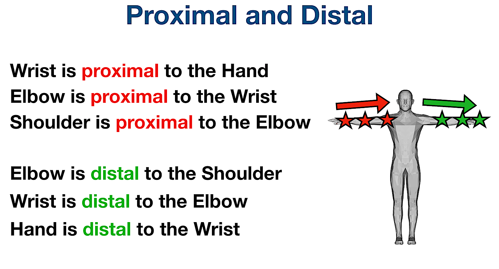
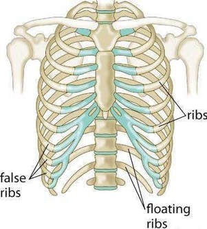

# Prime Surgical
## Knowledge & Training 
### Foundational Anatomy

In the foundation section, we will cover the basics of the human body. This will include the anatomy, physiology, and pathophysiology - mainly focused on the heart and broader thoracic cavity. The goal is to develop a solid understanding of the cadiovascular system & skeletal systems. This will help you understand the technical product specifics, and how they relate to the human body.

#### Anatomical Positioning & Types of Movement

Understanding anatomical positions and types of movement is crucial in the medical field as it provides a standardized way of describing the human body and its movements, ensuring clear communication among healthcare professionals.

##### Anatomical Positions

1. **Standard Anatomical Position**: 
   - The body is standing upright.
   - Feet are parallel and close together.
   - Arms are at the sides.
   - Palms face forward.
   - The head is level, and eyes are looking forward.

- **Sagittal Plane**: Divides the body into left and right halves.
- **Frontal (Coronal) Plane**: Divides the body into front (anterior) and back (posterior) halves.
- **Transverse (Horizontal) Plane**: Divides the body into upper (superior) and lower (inferior) halves.

2. **Prone Position**: 
   - The body is lying face down.

3. **Supine Position**: 
   - The body is lying face up.

##### Types of Movements

1. **Flexion and Extension**: 
   - **Flexion**: Decreasing the angle between two body parts, like bending the elbow.
   - **Extension**: Increasing the angle, like straightening the elbow.

2. **Abduction and Adduction**: 
   - **Abduction**: Movement away from the midline of the body, like lifting the arm sideways.
   - **Adduction**: Movement towards the midline, like bringing the arm back to the side.

3. **Medial and Lateral Rotation**: 
   - **Medial Rotation**: Turning towards the midline, like turning the head to face forward.
   - **Lateral Rotation**: Turning away from the midline, like turning the head to the side.

4. **Elevation and Depression**: 
   - **Elevation**: Moving a body part upwards, like shrugging the shoulders.
   - **Depression**: Moving a body part downwards, like relaxing the shoulders.

5. **Protraction and Retraction**: 
   - **Protraction**: Moving a body part forward, like jutting the jaw forward.
   - **Retraction**: Moving it backward, like pulling the jaw back.

6. **Supination and Pronation**: 
   - **Supination**: Rotating the forearm so the palm faces up.
   - **Pronation**: Rotating it so the palm faces down.

7. **Dorsiflexion and Plantarflexion** (pertaining to the foot):
   - **Dorsiflexion**: Bending the foot upwards, decreasing the angle between the foot and the shin.
   - **Plantarflexion**: Bending the foot downwards, increasing the angle.

8. **Inversion and Eversion** (pertaining to the foot):
   - **Inversion**: Turning the sole of the foot inward.
   - **Eversion**: Turning the sole of the foot outward.

9. **Opposition and Reposition** (pertaining to the thumb and little finger):
   - **Opposition**: Bringing the thumb and little finger towards each other.
   - **Reposition**: Moving them away from each other.

10. **Circumduction**: 
    - A conical movement involving sequential flexion, abduction, extension, and adduction, creating a circular or conical motion, like moving the arm in a circle.

##### Proximal and Distal

1. **Proximal**: 
   - Closer to the point of attachment or origin.
   - For example, the elbow is proximal to the wrist.

2. **Distal**: 
   - Farther from the point of attachment or origin.
   - For example, the wrist is distal to the elbow.

Understanding these positions and movements allows medical professionals to accurately describe and interpret physical examinations, radiographs, and surgical procedures. It's essential to be familiar with these terms to communicate effectively in clinical practice.

____

### CV

<iframe
        src="https://drive.google.com/file/d/11-CR2ZICZS6SsuI0EmKAPAX48qtllfxI/preview"
        width="600"
        height="800"
        allow="autoplay"
      ></iframe>

#### Overview of Cardiovascular Anatomy and Physiology

The cardiovascular system, also known as the circulatory system, is a complex network consisting of the heart, blood vessels, and blood. It performs the vital function of delivering oxygen and nutrients to tissues, while removing carbon dioxide and other waste products.

1. **Heart**:
   - **Anatomy**: The heart is a four-chambered muscular organ divided into two atria and two ventricles. The right side receives deoxygenated blood and pumps it to the lungs, while the left side receives oxygenated blood from the lungs and pumps it to the systemic circulation.

   - **Physiology**: The cardiac cycle comprises three major stages: atrial systole, ventricular systole, and diastole. These stages are coordinated by electrical signals originating from the sinoatrial (SA) node and traveling through the atrioventricular (AV) node and the His-Purkinje system.

1. **Blood Vessels**:
   - **Anatomy**: Blood vessels are categorized into arteries, veins, and capillaries. Arteries transport blood away from the heart, veins carry blood towards the heart, and capillaries facilitate the exchange of nutrients, gases, and waste between blood and tissues.

   - **Physiology**: The smooth muscle in the arterial walls enables vasoconstriction and vasodilation, crucial for regulating blood pressure and distribution. Veins have valves to prevent backflow, ensuring unidirectional flow towards the heart.

2. **Blood**:
   - **Composition**: Blood comprises red blood cells (RBCs) for oxygen transport, white blood cells (WBCs) for immunity, platelets for clotting, and plasma as the fluid medium carrying hormones, nutrients, and gases.

   - **Hemodynamics**: This refers to the physical principles governing the flow and pressure of blood, essential for understanding various pathological conditions and the action of numerous cardiovascular drugs.

3. **Microcirculation and Gas Exchange**:
   - In capillary beds, the exchange of oxygen, carbon dioxide, nutrients, and waste products occurs through diffusion, driven by concentration gradients.

4. **Regulatory Mechanisms**:
   - **Neural Regulation**: The cardiovascular center in the medulla oblongata modulates heart rate and blood vessel diameter in response to various stimuli.
   - **Hormonal Regulation**: Hormones like adrenaline, noradrenaline, and angiotensin II play significant roles in cardiovascular regulation.

5. **Cardiac Output and Blood Pressure**:
   - Cardiac output (CO) is the amount of blood pumped by the heart per minute and is a product of heart rate (HR) and stroke volume (SV). Blood pressure (BP) is crucial for perfusion to organs and is regulated by various factors including CO, blood volume, and vascular resistance.

<iframe
        src="https://drive.google.com/file/d/10nwfy-hNmu5RqWbuCeWxRTyHk2-5gnM4/preview"
        width="600"
        height="800"
        allow="autoplay"
      ></iframe>

_____

#### Circulatory Pathways - Pulmonary and Systemic Circulation

The human circulatory system operates via two interdependent pathways: the Pulmonary and Systemic Circulation. These pathways are crucial for transporting blood to and from the heart, thereby facilitating the exchange of gases, nutrients, and waste products throughout the body.

1. **Pulmonary Circulation**:
   - **Objective**: The primary aim of pulmonary circulation is to oxygenate the blood while expelling carbon dioxide.
   - **Pathway**: Deoxygenated blood from the body enters the right atrium via the superior and inferior vena cava. It then moves to the right ventricle, which pumps the blood through the pulmonary arteries to the lungs. Here, blood gets oxygenated during gas exchange in the alveoli.
   - **Return to Heart**: Oxygen-rich blood returns to the heart via the pulmonary veins, entering the left atrium, marking the transition from pulmonary to systemic circulation.

2. **Systemic Circulation**:
   - **Objective**: Systemic circulation aims to deliver oxygenated blood to various body tissues, ensuring the delivery of nutrients, hormones, and oxygen while removing waste products like carbon dioxide.
   - **Pathway**: From the left atrium, oxygen-enriched blood moves into the left ventricle, which pumps it into the aorta. The aorta branches into numerous smaller arteries and arterioles, which further subdivide into capillaries where the exchange of gases, nutrients, and waste occurs.
   - **Return to Heart**: After gas and nutrient exchange, deoxygenated blood collects into venules, which coalesce into veins, eventually forming the superior and inferior vena cava that return blood to the right atrium, marking the commencement of another pulmonary circulation cycle.

Blood leaves the heart through the aortic valve, through the ascending aorta, and out to the body. The subclavian arteries branch off the aorta, and supply blood to the arms. The carotid arteries branch off the aorta, and supply blood to the head. The descending aorta supplies blood to the rest of the body. 

1. **Key Regulatory Mechanisms**:
   - **Cardiac Cycle Coordination**: The coordination between the heart chambers ensures an efficient circulatory process. This coordination is governed by the heart’s electrical conduction system, involving the sinoatrial (SA) node, atrioventricular (AV) node, and the His-Purkinje system.
   - **Vascular Tone**: Vascular smooth muscle tone in arteries and arterioles plays a crucial role in regulating blood pressure and, consequently, blood flow to different body parts.
   - **Capillary Dynamics**: Capillary permeability and pre-capillary sphincters manage blood flow through capillary beds, aiding in tissue perfusion and nutrient exchange.

2. **Physiological Variables**:
   - Variables like heart rate, stroke volume, and systemic vascular resistance are essential determinants of systemic and pulmonary circulation efficacy. Understanding these variables provides insight into pathological states and therapeutic interventions.

3. **Pathophysiological Implications**:
   - Disruptions in either circulation pathway can result in pathological conditions. For example, obstruction in pulmonary circulation can lead to pulmonary hypertension, while systemic circulation disruptions can result in conditions like peripheral artery disease.

This overview elucidates the core structural and functional facets of pulmonary and systemic circulatory pathways, foundational knowledge for comprehending the broader cardiovascular physiology and pathology.
___

#### Definition and Pathology of Ischemic Heart Disease

Ischemic Heart Disease (IHD), also known as Coronary Artery Disease (CAD) or Coronary Heart Disease (CHD), is a pathological condition characterized by reduced blood supply to the heart muscle, primarily due to obstruction or spasm of the coronary arteries. It is a leading cause of mortality and morbidity worldwide, and understanding its pathophysiology is paramount for the aspiring medical practitioner.

1. **Atherosclerosis**:
   - The fundamental pathology underlying IHD is atherosclerosis, a process characterized by the accumulation of cholesterol-laden plaques within the walls of coronary arteries. Over time, these plaques narrow the arteries, reducing blood flow to the myocardium.

2. **Endothelial Dysfunction**:
   - Endothelial dysfunction often precedes atherosclerosis, where the inner lining of the arteries (endothelium) loses its normal functioning, impairing vasodilation, and promoting inflammation and plaque formation.

3. **Plaque Rupture and Thrombosis**:
   - An acute coronary event often occurs when a plaque ruptures, triggering blood clot formation (thrombosis). This can further occlude the artery, leading to a significant reduction or cessation of blood flow downstream.

4. **Ischemia and Myocardial Infarction (MI)**:
   - The consequence of reduced blood flow (ischemia) can range from angina pectoris (chest pain) to myocardial infarction (MI), where prolonged ischemia causes necrosis of the myocardial tissue.

5. **Compensatory Mechanisms**:
   - Initially, the heart tries to compensate for reduced blood supply through various mechanisms like collateral circulation, where small blood vessels remodel themselves to bypass blockages. However, these compensations are often insufficient during increased demand, such as exercise.

6. **Electrical Instability**:
   - Ischemia can disrupt the electrical activity of the heart, leading to arrhythmias, which are a significant cause of morbidity in IHD.

7. **Heart Failure**:
   - Chronic IHD can lead to heart failure, a condition where the heart is unable to pump blood effectively to meet the body's needs.

8. **Diagnosing Ischemic Heart Disease**:
   - Diagnosis is usually based on a combination of clinical history, physical examination, electrocardiogram (ECG), stress testing, and imaging studies like coronary angiography.

9. **Risk Factors**:
   - Identifiable risk factors include hypertension, hyperlipidemia, smoking, diabetes, obesity, and a family history of cardiovascular disease.

10. **Clinical Management**:
   - Management strategies aim to restore coronary perfusion, alleviate symptoms, and prevent future cardiac events. These include lifestyle modifications, pharmacotherapy (e.g., antiplatelets, statins), and interventional procedures like angioplasty and coronary artery bypass grafting (CABG).

This summary delineates the critical concepts surrounding ischemic heart disease, offering an essential foundation for further exploration into its diagnosis, management, and the broader implications for cardiovascular health and disease.

 <iframe
        src="https://drive.google.com/file/d/10tXU2EWWcach721eQaTZvougHX7kiefG/preview"
        width="600"
        height="800"
        allow="autoplay"
      ></iframe>

____

#### Acquired Valvular Heart Diseases: Stenosis and Regurgitation

Valvular heart diseases, predominantly manifesting as Stenosis or Regurgitation, are pathologies involving one or more of the heart’s valves (**aortic**, **mitral**, tricuspid, and pulmonary). Acquired as opposed to congenital valvular diseases arise due to various factors such as aging, infections or other cardiac diseases. Understanding these diseases is pivotal for a burgeoning medical practitioner.
* aortic and mitral are the most commonly treated valves, as they're the valves on the left side of the heart, which is the side that pumps blood to the body.

1. **Stenosis**:
    - **Definition**: Stenosis refers to the narrowing of the valvular orifice, impeding blood flow.
    - **Pathophysiology**: Common causes include calcific degeneration, rheumatic heart disease, or radiation therapy. The obstruction forces the heart to pump harder, leading to hypertrophy and potentially heart failure.
    - **Clinical Presentation**: Symptoms like fatigue, dyspnea, and chest discomfort are common. On examination, a harsh ejection systolic murmur is often discernible.

2. **Regurgitation (Insufficiency)**:
    - **Definition**: Regurgitation involves the backflow of blood due to incomplete valve closure.
    - **Pathophysiology**: Causes encompass mitral valve prolapse, infective endocarditis, or dilation of the valve annulus. The volume overload can lead to dilatation and eventual failure of the associated chamber.
    - **Clinical Presentation**: Patients may present with palpitations, fatigue, and a blowing holosystolic murmur on examination.

3. **Common Acquired Valvular Disorders**:
    - **Aortic Stenosis**: Often due to calcification in the elderly or rheumatic heart disease.
    - **Mitral Regurgitation**: Mitral valve prolapse or ischemic heart disease are common culprits.
    - **Aortic Regurgitation**: Typically arises from hypertension, endocarditis, or congenital aortic root diseases, like Marfan syndrome or a bicuspid valve.
    - **Mitral Stenosis**: Mostly associated with rheumatic heart disease.

4. **Diagnosis**:
    - **Physical Examination**: Auscultation can reveal characteristic murmurs.
    - **Imaging**: Echocardiography is the cornerstone for diagnosis, providing insight into the valve anatomy and function. Other modalities include cardiac MRI and CT.
    - **Cardiac Catheterization**: Helps in assessing the severity and in planning for surgical intervention.

5. **Management**:
    - **Medical Management**: Aims at symptom relief using diuretics, beta-blockers, or ACE inhibitors.
    - **Surgical Management**: Includes valve repair or replacement via open surgery, minimally invasive surgery or transcatheter techniques.

6. **Prognosis and Follow-Up**:
    - Early detection and intervention are crucial for a favorable prognosis. Regular follow-up with echocardiographic assessments is necessary to monitor disease progression and treatment efficacy.

<iframe
   src="https://drive.google.com/file/d/10fwzm2Smdvfw99Z1A0YJLlGGjWHr5n25/preview"
   width="600"
   height="800"
   allow="autoplay"
   ></iframe>

___

#### Congenital Heart Defects: ASD, VSD, PDA, Tetralogy of Fallot**

Congenital heart defects (CHDs) are intrinsic abnormalities in the heart's structure that occur from birth. Such anomalies significantly impact hemodynamics and necessitate intricate understanding and management. This overview synthesizes critical insights into four prevalent congenital heart defects: Atrial Septal Defect (ASD), Ventricular Septal Defect (VSD), Patent Ductus Arteriosus (PDA), and Tetralogy of Fallot (TOF).

Congenital heart programs are isolated specialized centers, at children's hospitals. The centers in South Florida are Holtz Children's (Jackson Health System), Joe DiMaggio Children's (Memorial Healthcare System), and Nicklaus Children's (Miami Children's Health System).

We will not focus her early on, as they are not the focus of our business. However, it is important to understand the basics of these defects, as they are the foundation for understanding the broader cardiovascular system.

##### 1. Atrial Septal Defect (ASD)
- **Definition**: ASD involves an opening in the septum between the atria, enabling blood flow between them.
- **Pathophysiology**: 
    - Left-to-right shunt leads to right atrial and ventricular volume overload.
    - Potential risk for atrial arrhythmias and, rarely, Eisenmenger syndrome.
- **Clinical Presentation**: 
    - May be asymptomatic or present with dyspnea, fatigue, and palpitations.
- **Diagnosis**: 
    - Echocardiography chiefly identifies ASD.
- **Management**: 
    - Small ASDs may close spontaneously; larger defects might require percutaneous closure or surgery.

##### 2. Ventricular Septal Defect (VSD)
- **Definition**: VSD encompasses an opening in the interventricular septum.
- **Pathophysiology**: 
    - Shunting of blood from the left to the right ventricle.
    - Can cause heart failure and predispose to infective endocarditis.
- **Clinical Presentation**: 
    - Failure to thrive, recurrent respiratory infections, or asymptomatic.
- **Diagnosis**: 
    - Recognized through echocardiography.
- **Management**: 
    - Small defects may not necessitate intervention, while significant shunting or symptoms may require surgical repair.

##### 4. Tetralogy of Fallot (TOF)
- **Definition**: TOF consists of four anomalies: VSD, overriding aorta, pulmonary stenosis, and right ventricular hypertrophy.
- **Pathophysiology**: 
    - Blood bypasses the pulmonary circulation, resulting in cyanosis.
- **Clinical Presentation**: 
    - "Tet" spells (hypoxic spells), cyanosis, and dyspnea on exertion.
- **Diagnosis**: 
    - Echocardiography and cardiac catheterization are essential for diagnosis.
- **Management**: 
    - Total repair surgery, typically involving VSD closure and relief of pulmonary obstruction, is the mainstay.

##### Shared Considerations for CHDs
- **Perioperative Care**: Vital in surgical interventions to optimize outcomes.
- **Long-term Management**: Lifelong follow-up to monitor for complications such as arrhythmias, heart failure, and other sequelae.
- **Genetic Counseling**: Given the genetic components of CHDs, counseling is pivotal.
- **Preventive Care**: 
    - Vaccinations and endocarditis prophylaxis are crucial in CHDs.

##### Summary
Congenital heart defects embody a spectrum of disorders, each with its unique pathophysiology and clinical implications. A robust understanding of their intricacies provides the substrate for impeccable diagnosis, management, and overall holistic care, guiding affected individuals through potential challenges throughout their lifespan. 

___
### The Rest of the Thoracic Cavity

VIDEO: The Sternum and Ribs - Anatomy Tutorial (just watch the first section on sternum and ribs)

<iframe width="700" height="420" src="https://www.youtube.com/embed/ggJCoxOdv8c" frameborder="0" allowfullscreen></iframe>

#### Key Concept: **Anatomy of the Sternum**

The sternum, also known as the breastbone, is a flat bone that forms the anterior portion of the chest wall. It is a T-shaped bone that is divided into three parts: the manubrium, the body, and the xiphoid process.

**Manubrium**

The manubrium is the broad, superior segment of the sternum. It articulates with the clavicles at the sternoclavicular joints and with the costal cartilages of the first pair of ribs. The manubrium also has a number of important landmarks, including the jugular notch, which is located at the superior margin of the manubrium and lies between the two clavicles.

**Body**

The body of the sternum is the middle portion of the bone. It articulates with the costal cartilages of the second to seventh pairs of ribs. The body of the sternum is also the site of attachment for a number of muscles, including the pectoralis major, pectoralis minor, and sternocleidomastoid muscles.

**Xiphoid process**

The xiphoid process is the narrow, inferior segment of the sternum. It is a cartilaginous structure in children and young adults, but it ossifies (hardens) with age. The xiphoid process is the site of attachment for the diaphragm and the rectus abdominis muscles.

[Image of Xiphoid process anatomy]

**Functions of the sternum**

The sternum has a number of important functions, including:

* **Protection:** The sternum helps to protect the vital organs of the chest, including the heart, lungs, and major blood vessels.
* **Support:** The sternum provides support for the rib cage and helps to maintain the shape of the chest.
* **Muscle attachment:** The sternum is the site of attachment for a number of important muscles, including the pectoralis major, pectoralis minor, sternocleidomastoid, diaphragm, and rectus abdominis muscles.

**Common injuries of the sternum**

* **Fracture:** A fracture of the sternum can occur due to a traumatic injury, such as a car accident or a fall from a height.
  
____

#### Key Concept - Anatomy of the Ribs

The rib cage is a bony structure that encloses and protects the thoracic organs, including the heart and lungs. It also plays a vital role in the mechanics of breathing. The rib cage is made up of 12 pairs of ribs, which are categorized into true ribs, false ribs, and floating ribs based on their anatomical connections.

**True Ribs**

The first seven pairs of ribs are known as true ribs. They are directly attached to the sternum through their costal cartilages. These ribs are typically more robust and have a more pronounced curve compared to the other ribs.

**False Ribs**

Ribs 8, 9, and 10 are referred to as false ribs. Unlike true ribs, they do not attach directly to the sternum. Instead, their costal cartilages connect to the cartilage of the rib above them, forming an indirect connection to the sternum.

**Floating Ribs**

The 11th and 12th pairs of ribs are known as floating ribs because they do not have any anterior attachment to the sternum. They are much shorter than the other ribs and have a more tapered shape.

**Anatomical Features of a Typical Rib**

- **Head:** The head of the rib articulates with the vertebral bodies.
- **Neck:** The neck is the flattened part that extends laterally from the head.
- **Tubercle:** The tubercle of the rib articulates with the transverse process of the vertebra.
- **Body (Shaft):** The body or shaft of the rib is the flattened, curved main part of the rib.

**Functions of the Ribs**

- **Protection:** The ribs serve to protect the vital organs within the thoracic cavity, such as the heart and lungs.
- **Support:** The rib cage provides structural support to the thoracic region and maintains the shape of the thoracic cavity.
- **Respiration:** The ribs assist in the process of respiration by altering the volume of the thoracic cavity during breathing.

**Common Conditions and Injuries Related to the Ribs**

- **Rib Fracture:** A common injury resulting from trauma, such as falls, accidents, or impact during sports.
- **Costochondritis:** Inflammation of the rib cartilage, particularly where the ribs attach to the sternum.
- **Rib Dislocation:** A condition where the rib or its cartilage moves out of its normal position.
___

#### Key Concept: **Anatomy of the Lungs**

The lungs are vital organs in the respiratory system that facilitate the exchange of oxygen and carbon dioxide between the air we breathe and the blood. Located within the thoracic cavity, they are protected by the ribcage and are closely associated with the heart and the blood vessels.

**Basic Anatomy of the Lungs**

- **Lobes:** The right lung is divided into three lobes (upper, middle, and lower), while the left lung has two (upper and lower) to accommodate the heart.
- **Pleura:** Each lung is enclosed in a pleural sac, which consists of two layers: the visceral pleura (which adheres to the lung) and the parietal pleura (which lines the chest wall).
- **Bronchi:** The trachea divides into two primary bronchi, which enter the lungs and further divide into secondary and tertiary bronchi.
- **Alveoli:** Tiny, sac-like structures where gas exchange occurs.

**Physiology of the Lungs**

- **Gas Exchange:** Oxygen from the inhaled air diffuses into the blood in the pulmonary capillaries, while carbon dioxide diffuses from the blood into the alveoli to be exhaled.
- **Ventilation:** The process of moving air in and out of the lungs, facilitated by the diaphragm and intercostal muscles.

**Functions of the Lungs**

- **Respiration:** Facilitating the exchange of gases (oxygen and carbon dioxide) between the atmosphere and the bloodstream.
- **Filtering and Humidifying Air:** The lungs help to filter out particles and add moisture to the inhaled air.
- **Regulating Blood pH:** Through the exchange of oxygen and carbon dioxide, the lungs play a role in maintaining the pH balance of the blood.

**Common Conditions Affecting the Lungs**

- **Pneumonia:** Inflammation of the lung tissue, usually caused by infection.
- **Chronic Obstructive Pulmonary Disease (COPD):** A group of lung diseases that block airflow and make it difficult to breathe.
- **Asthma:** A condition in which the airways narrow and swell, producing extra mucus, which makes breathing difficult.
- **Lung Cancer:** A type of cancer that begins in the lungs, often in cells lining the air passages.

##### Lung Cancer

Lung cancer, one of the most common malignancies worldwide, often necessitates surgical intervention as a part of its management, especially in the early stages. Various surgical techniques, including minimally invasive approaches like Video-Assisted Thoracic Surgery (VATS) and robotic-assisted thoracic surgery, have been employed to manage lung cancer effectively.

#### **Video-Assisted Thoracic Surgery (VATS)**

**Definition:** VATS is a type of minimally invasive surgery that utilizes a small video camera (thoracoscope) to visualize the surgical field inside the thoracic cavity, which is displayed on a monitor, and small incisions are used to access the lungs.

**Common Procedures:**
- **Lobectomy:** Removal of a lobe of the lung.
- **Wedge Resection:** Removal of a small, wedge-shaped portion of the lung.
- **Segmentectomy:** Removal of a segment of a lung lobe.

**Advantages:**
- Reduced post-operative pain.
- Shorter hospital stay.
- Lower risk of infection.
- Quicker recovery.

#### **Robotic-Assisted Thoracic Surgery**

**Definition:** Robotic-assisted thoracic surgery employs a robotic system, which the surgeon controls from a console, to perform surgery through small incisions, providing enhanced visualization and precision.

**Common Procedures:**
- **Robotic-Assisted Lobectomy:** Removal of a lobe using robotic assistance.
- **Robotic-Assisted Pneumonectomy:** Removal of an entire lung using robotic assistance.

