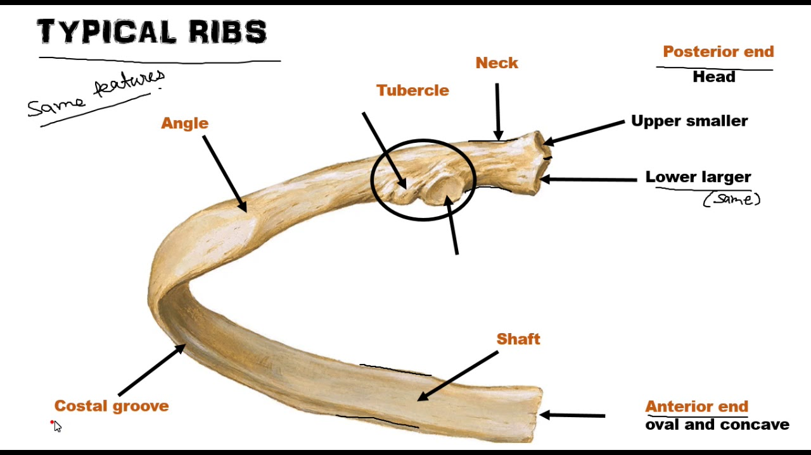
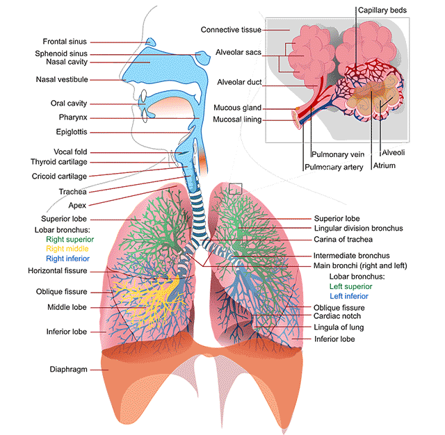
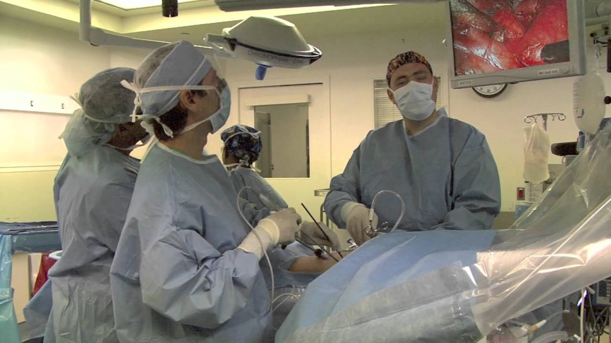
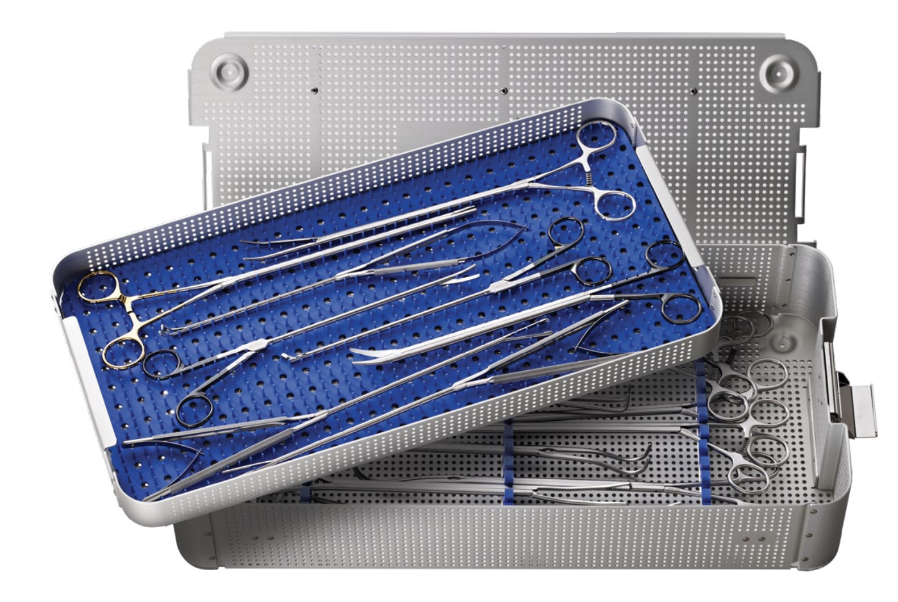

___
### The Rest of the Thoracic Cavity

VIDEO: The Sternum and Ribs - Anatomy Tutorial (just watch the first section on sternum and ribs)

<iframe width="700" height="420" src="https://www.youtube.com/embed/ggJCoxOdv8c" frameborder="0" allowfullscreen></iframe>

#### Key Concept: **Anatomy of the Sternum**

The sternum, also known as the breastbone, is a flat bone that forms the anterior portion of the chest wall. It is a T-shaped bone that is divided into three parts: the manubrium, the body, and the xiphoid process.

**Manubrium**

The manubrium is the broad, superior segment of the sternum. It articulates with the clavicles at the sternoclavicular joints and with the costal cartilages of the first pair of ribs. The manubrium also has a number of important landmarks, including the jugular notch, which is located at the superior margin of the manubrium and lies between the two clavicles.

**Body**

The body of the sternum is the middle portion of the bone. It articulates with the costal cartilages of the second to seventh pairs of ribs. The body of the sternum is also the site of attachment for a number of muscles, including the pectoralis major, pectoralis minor, and sternocleidomastoid muscles.

**Xiphoid process**

The xiphoid process is the narrow, inferior segment of the sternum. It is a cartilaginous structure in children and young adults, but it ossifies (hardens) with age. The xiphoid process is the site of attachment for the diaphragm and the rectus abdominis muscles.

[Image of Xiphoid process anatomy]

**Functions of the sternum**

The sternum has a number of important functions, including:

* **Protection:** The sternum helps to protect the vital organs of the chest, including the heart, lungs, and major blood vessels.
* **Support:** The sternum provides support for the rib cage and helps to maintain the shape of the chest.
* **Muscle attachment:** The sternum is the site of attachment for a number of important muscles, including the pectoralis major, pectoralis minor, sternocleidomastoid, diaphragm, and rectus abdominis muscles.

**Common injuries of the sternum**

* **Fracture:** A fracture of the sternum can occur due to a traumatic injury, such as a car accident or a fall from a height.
  
____

#### Key Concept - Anatomy of the Ribs

The rib cage is a bony structure that encloses and protects the thoracic organs, including the heart and lungs. It also plays a vital role in the mechanics of breathing. The rib cage is made up of 12 pairs of ribs, which are categorized into true ribs, false ribs, and floating ribs based on their anatomical connections.

**True Ribs**

The first seven pairs of ribs are known as true ribs. They are directly attached to the sternum through their costal cartilages. These ribs are typically more robust and have a more pronounced curve compared to the other ribs.

**False Ribs**

Ribs 8, 9, and 10 are referred to as false ribs. Unlike true ribs, they do not attach directly to the sternum. Instead, their costal cartilages connect to the cartilage of the rib above them, forming an indirect connection to the sternum.

**Floating Ribs**

The 11th and 12th pairs of ribs are known as floating ribs because they do not have any anterior attachment to the sternum. They are much shorter than the other ribs and have a more tapered shape.

**Anatomical Features of a Typical Rib**

- **Head:** The head of the rib articulates with the vertebral bodies.
- **Neck:** The neck is the flattened part that extends laterally from the head.
- **Tubercle:** The tubercle of the rib articulates with the transverse process of the vertebra.
- **Body (Shaft):** The body or shaft of the rib is the flattened, curved main part of the rib.

**Functions of the Ribs**

- **Protection:** The ribs serve to protect the vital organs within the thoracic cavity, such as the heart and lungs.
- **Support:** The rib cage provides structural support to the thoracic region and maintains the shape of the thoracic cavity.
- **Respiration:** The ribs assist in the process of respiration by altering the volume of the thoracic cavity during breathing.

**Common Conditions and Injuries Related to the Ribs**

- **Rib Fracture:** A common injury resulting from trauma, such as falls, accidents, or impact during sports.
- **Costochondritis:** Inflammation of the rib cartilage, particularly where the ribs attach to the sternum.
- **Rib Dislocation:** A condition where the rib or its cartilage moves out of its normal position.
___

#### Key Concept: **Anatomy of the Lungs**

The lungs are vital organs in the respiratory system that facilitate the exchange of oxygen and carbon dioxide between the air we breathe and the blood. Located within the thoracic cavity, they are protected by the ribcage and are closely associated with the heart and the blood vessels.

**Basic Anatomy of the Lungs**

- **Lobes:** The right lung is divided into three lobes (upper, middle, and lower), while the left lung has two (upper and lower) to accommodate the heart.
- **Pleura:** Each lung is enclosed in a pleural sac, which consists of two layers: the visceral pleura (which adheres to the lung) and the parietal pleura (which lines the chest wall).
- **Bronchi:** The trachea divides into two primary bronchi, which enter the lungs and further divide into secondary and tertiary bronchi.
- **Alveoli:** Tiny, sac-like structures where gas exchange occurs.

**Physiology of the Lungs**

- **Gas Exchange:** Oxygen from the inhaled air diffuses into the blood in the pulmonary capillaries, while carbon dioxide diffuses from the blood into the alveoli to be exhaled.
- **Ventilation:** The process of moving air in and out of the lungs, facilitated by the diaphragm and intercostal muscles.

**Functions of the Lungs**

- **Respiration:** Facilitating the exchange of gases (oxygen and carbon dioxide) between the atmosphere and the bloodstream.
- **Filtering and Humidifying Air:** The lungs help to filter out particles and add moisture to the inhaled air.
- **Regulating Blood pH:** Through the exchange of oxygen and carbon dioxide, the lungs play a role in maintaining the pH balance of the blood.

**Common Conditions Affecting the Lungs**

- **Pneumonia:** Inflammation of the lung tissue, usually caused by infection.
- **Chronic Obstructive Pulmonary Disease (COPD):** A group of lung diseases that block airflow and make it difficult to breathe.
- **Asthma:** A condition in which the airways narrow and swell, producing extra mucus, which makes breathing difficult.
- **Lung Cancer:** A type of cancer that begins in the lungs, often in cells lining the air passages.

##### Lung Cancer

Lung cancer, one of the most common malignancies worldwide, often necessitates surgical intervention as a part of its management, especially in the early stages. Various surgical techniques, including minimally invasive approaches like Video-Assisted Thoracic Surgery (VATS) and robotic-assisted thoracic surgery, have been employed to manage lung cancer effectively.

#### **Video-Assisted Thoracic Surgery (VATS)**

**Definition:** VATS is a type of minimally invasive surgery that utilizes a small video camera (thoracoscope) to visualize the surgical field inside the thoracic cavity, which is displayed on a monitor, and small incisions are used to access the lungs.

**Common Procedures:**
- **Lobectomy:** Removal of a lobe of the lung.
- **Wedge Resection:** Removal of a small, wedge-shaped portion of the lung.
- **Segmentectomy:** Removal of a segment of a lung lobe.

**Advantages:**
- Reduced post-operative pain.
- Shorter hospital stay.
- Lower risk of infection.
- Quicker recovery.

#### **Robotic-Assisted Thoracic Surgery**

**Definition:** Robotic-assisted thoracic surgery employs a robotic system, which the surgeon controls from a console, to perform surgery through small incisions, providing enhanced visualization and precision.

**Common Procedures:**
- **Robotic-Assisted Lobectomy:** Removal of a lobe using robotic assistance.
- **Robotic-Assisted Pneumonectomy:** Removal of an entire lung using robotic assistance.

