# Prime Surgical
## Knowledge & Training 
### Surgical Interventions in Cardiac Diseases: CABG, Valve Replacements, Transcatheter Interventions

The realm of cardiac surgery has evolved significantly, with a spectrum of surgical interventions available to manage and treat various cardiac diseases. In this module, we will delve into three pivotal procedures: Coronary Artery Bypass Grafting (CABG), Valve Replacements, and Transcatheter Interventions.

As we covered in the anatomy module, the heart is a complex system composed of two pumps. It uses coordinated electrical impulses to more blood through the pressure-valve system. Ischemic diseases require intervention of the pipes, or blood vessels. Valvular diseases require intervention of the valves. 

As the procedural protocol has evolved throughout the last few decades, surgeons have often partnered with industry to develop the tools and methods to perform specifed aspects of the procedures. In this section I will highlight some of the key concepts in cardiac surgery and the products that are used to perform the procedures.

This is a percursor to the next section, where we will explore our portfolio, and get more into the specifics, strategy, and prefrence profiles of the surgeons and teams we work with. 

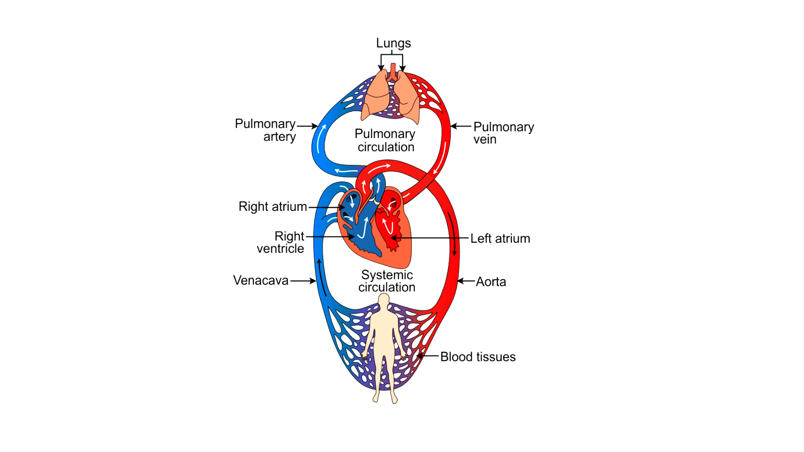

#### Overview: Common Procedures

1. **Coronary Artery Bypass Grafting (CABG)**:
    - **Objective**: CABG aims to restore blood flow to ischemic myocardium by bypassing obstructed coronary arteries.
    - **Procedure**:
        - Autologous vessels, usually the internal mammary artery or saphenous vein, are harvested.
        - The patient is often placed on cardiopulmonary bypass (CPB).
        - The harvested vessel is grafted to the aorta and the site past the obstruction, bypassing the stenotic areas.
    - **Indications**: Significant obstruction in the coronary arteries, particularly in patients with left main coronary disease or severe triple-vessel disease.
    - **Outcomes**: CABG has been shown to improve survival and quality of life in individuals with advanced coronary artery disease.
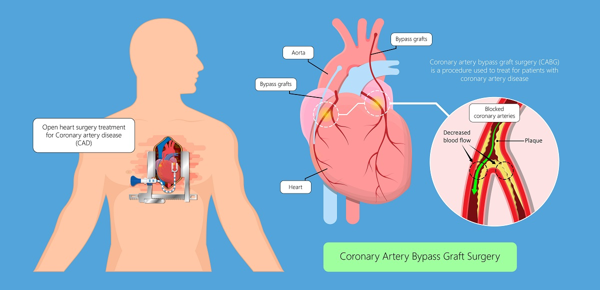

1. **Valve Replacements & Repairs**:
    - **Objective**: To replace dysfunctional heart valves that are either stenotic or regurgitant, restoring normal hemodynamics.
    - **Procedure**:
        - **Mechanical Valves**: Known for durability but require lifelong anticoagulation to prevent thromboembolic events.
        - **Bioprosthetic Valves**: Have lower thrombogenicity but are less durable than mechanical valves.
        - **Valve Repair**: Involves various techniques to repair the native valve, such as commissurotomy, annuloplasty, or chordal reconstruction.
    - **Indications**: Severe valvular stenosis or regurgitation affecting the patient's quality of life and cardiac function.
    - **Outcomes**: Valve replacements significantly alleviate symptoms and improve survival, although they may require re-operation over time, especially bioprosthetic valves.
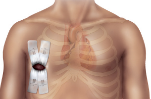

1. **Transcatheter Interventions**:
    - **Transcatheter Aortic Valve Replacement (TAVR)**:
        - **Objective**: A less invasive alternative to surgical aortic valve replacement, especially beneficial for high-risk surgical candidates.
        - **Procedure**: A bioprosthetic valve is delivered via a catheter, usually through the femoral artery, and is deployed in the position of the native aortic valve.
  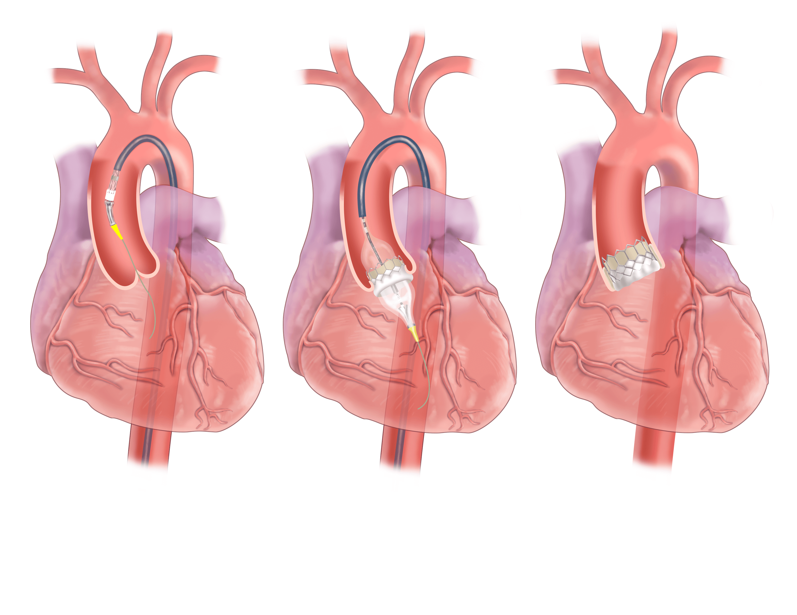
    - **Transcatheter Mitral Valve Repair (TMVr)**:
        - **Objective**: To repair the mitral valve in a less invasive manner compared to traditional surgery.
        - **Procedure**: Devices like the MitraClip are utilized to create a double-orifice valve, improving leaflet coaptation and reducing regurgitation.
    - **Percutaneous Coronary Interventions (PCI)**:
        - **Objective**: To alleviate coronary artery obstructions, improving myocardial perfusion.
        - **Procedure**: A stent is delivered to the site of obstruction and deployed to keep the artery open.
  

4. **Post-operative Care**:
    - **Monitoring**: Continuous monitoring in the initial post-operative period is essential to identify and manage complications like arrhythmias, infections, or bleeding.
    - **Rehabilitation**: Cardiac rehabilitation is pivotal for optimizing recovery, educating the patient on lifestyle modifications, and monitoring for any signs of disease recurrence or post-operative complications.
5. **Future Trends**:
    - The advent of minimally invasive surgical techniques, robotic-assisted surgeries, and continuous advancements in transcatheter interventions herald an exciting era in cardiac surgery.

Understanding the intricacies, indications, and outcomes of these surgical interventions is foundational for future learning.

___

#### Key Concept: **Suturing in Surgical Practice**

Suturing, a fundamental skill in surgical practice, involves using a needle and thread to close incisions, repair tissues, and facilitate healing. In the context of cardiothoracic surgery, suturing is pivotal in ensuring the stability and integrity of repaired structures, such as vessels, heart valves, and tissue layers.

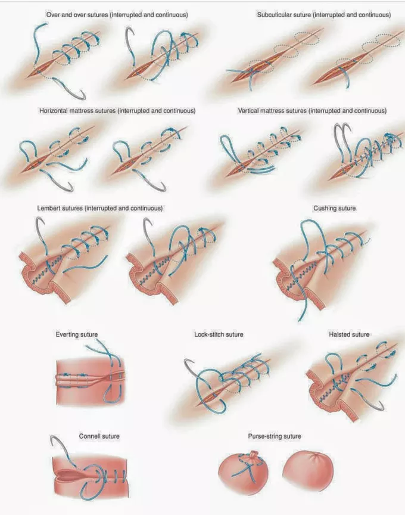

**Types of Sutures**

- **Absorbable vs. Non-absorbable:** Absorbable sutures are broken down by the body over time, while non-absorbable ones remain indefinitely and may require removal.
- **Monofilament vs. Multifilament:** Monofilament sutures consist of a single thread, while multifilament sutures are braided. Monofilament sutures are less prone to infection, while multifilament sutures provide better knot security.
- **Natural vs. Synthetic:** Sutures can be made from natural materials, like silk or catgut, or from synthetic materials, such as polypropylene or nylon.

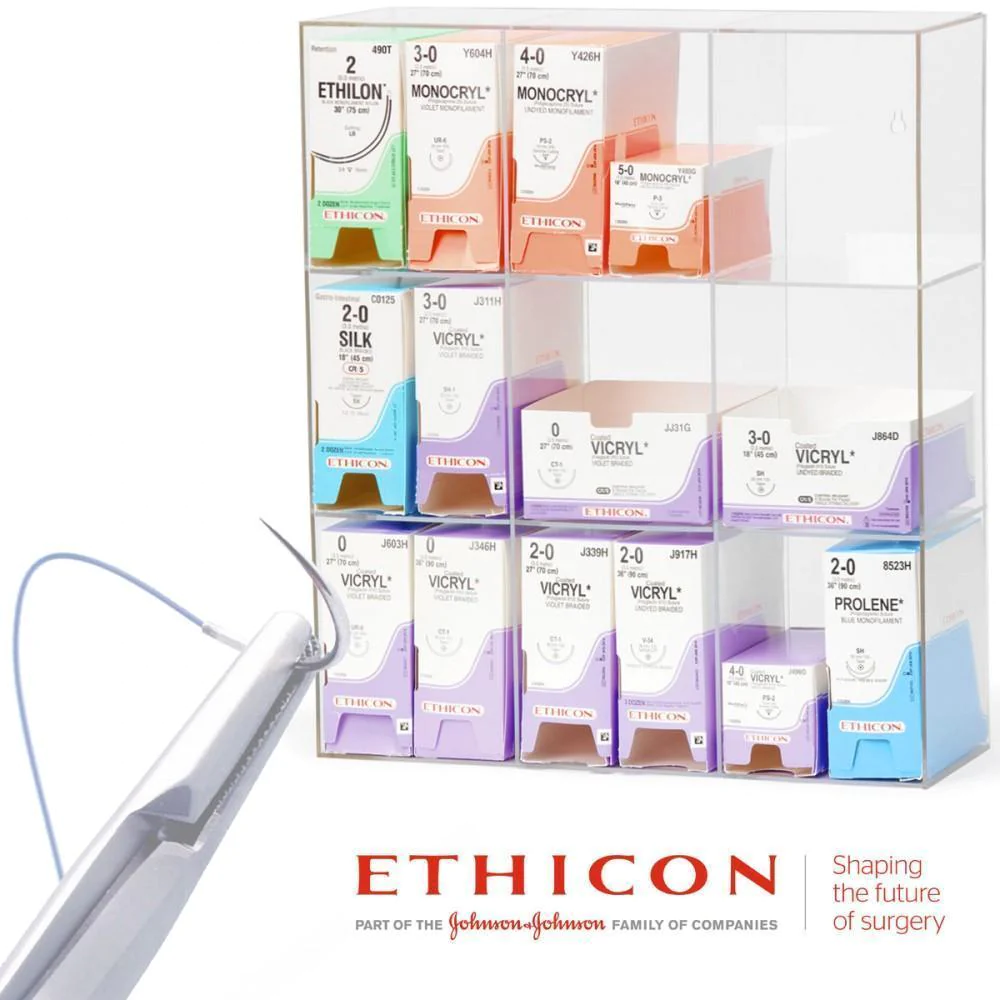

**Suture Sizing**

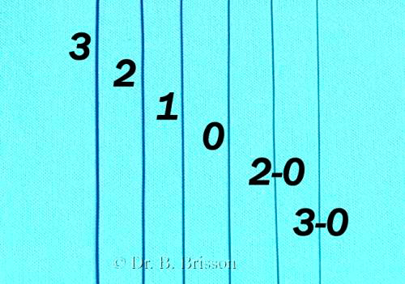

With suture Size 0 is the baseline. Moving to the left (1, 2, 3, etc.) the suture gets larger. Moving to the right (1-0, 2-0, 3-0, etc.) the suture gets smaller.

For reference size 0 represents the "stay" sutures used for pericardial retraction, or the closure of large skin incisions. Size 2-0 is typically used to sew in boprosthetic valves. Size 7-0 is used to do a distal anastomosis in CABG. Size 5-0 or 6-0 is typically used to do a proximal anaostomosis in CABG.

The same sizing methodology works for the stainless steel sternal wires we will cover thoughout this curriculum. The most common size for sternal wire used is size 6, which is on the other side of the spectrum.  

**Key Suturing Techniques**

1. **Simple Interrupted Suture:**
   - **Usage:** Widely used for closing incisions and wound edges.
   - **Process:** Individual stitches are placed and tied separately.
   - **Advantages:** If one suture fails, the others remain intact.

2. **Running or Continuous Suture:**
   - **Usage:** Useful for long incisions where speed is crucial.
   - **Process:** A single suture thread is used to sew along the length of the wound without tying individual knots.
   - **Advantages:** Quick and uses less suture material.
   - **Disadvantages:** If the suture breaks, the entire line may fail.

3. **Mattress Suture:**
   - **Usage:** Employed to approximate wound edges and distribute tension.
   - **Process:** The suture is passed perpendicular to the wound, encompassing larger amounts of tissue.
   - **Advantages:** Reduces tension across the wound and promotes healing.

4. **Purse-String Suture:**
   - **Usage:** Commonly used in cardiovascular surgeries, such as securing heart valves or closing openings in vessels, such as the aorta following direct aortic cannulation.
   - **Process:** A continuous circular suture is placed, which can be tightened like a drawstring.
   - **Advantages:** Enables closure of circular defects or openings.

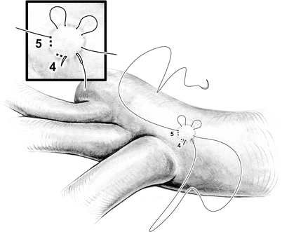
**Suturing in Cardiothoracic Surgery**

- **Vascular Anastomosis:** Suturing is vital in creating secure and patent connections between vessels, such as in CABG.
- **Valve Replacement:** Sutures are used to anchor prosthetic heart valves securely in place.
- **Tissue Repair:** Suturing facilitates the repair of damaged tissues, ensuring they heal appropriately.
- **Closing Incisions:** Ensuring that thoracic and sternotomy incisions are closed securely and neatly to promote healing and minimize scarring.

**Considerations in Suturing**

- **Tissue Handling:** Gentle and precise handling of tissues is crucial to minimize trauma and promote healing.
- **Knot Tying:** Secure and appropriately tensioned knots ensure the stability of the suture and prevent leakage, especially in vascular anastomoses.
- **Suture Selection:** Choosing the appropriate suture material and size is pivotal, considering the tissue type and desired duration of support.

In summary, suturing is an indispensable skill in surgery, with various techniques and materials tailored to the specific requirements of the procedure and tissue type. Mastery of suturing techniques is vital for surgeons to ensure optimal patient outcomes, particularly in the intricate and high-stakes context of cardiothoracic surgery.

___

#### Key Concept: **Anatomy of the Sternum**

The sternum, also known as the breastbone, is a flat bone that forms the anterior portion of the chest wall. It is a T-shaped bone that is divided into three parts: the manubrium, the body, and the xiphoid process.

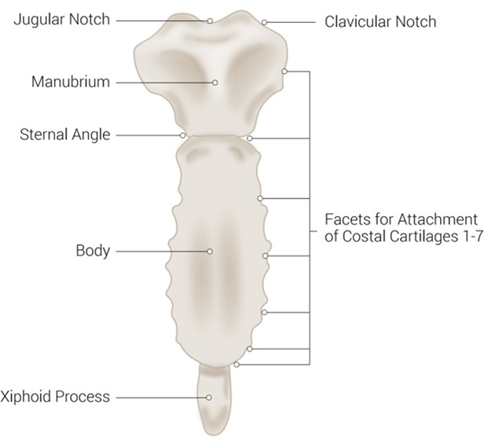

**Manubrium**

The manubrium is the broad, superior segment of the sternum. It articulates with the clavicles at the sternoclavicular joints and with the costal cartilages of the first pair of ribs. The manubrium also has a number of important landmarks, including the jugular notch, which is located at the superior margin of the manubrium and lies between the two clavicles.

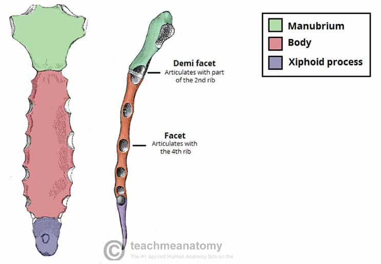

**Body**

The body of the sternum is the middle portion of the bone. It articulates with the costal cartilages of the second to seventh pairs of ribs. The body of the sternum is also the site of attachment for a number of muscles, including the pectoralis major, pectoralis minor, and sternocleidomastoid muscles.

**Xiphoid process**

The xiphoid process is the narrow, inferior segment of the sternum. It is a cartilaginous structure in children and young adults, but it ossifies (hardens) with age. The xiphoid process is the site of attachment for the diaphragm and the rectus abdominis muscles.

[Image of Xiphoid process anatomy]

**Functions of the sternum**

The sternum has a number of important functions, including:

* **Protection:** The sternum helps to protect the vital organs of the chest, including the heart, lungs, and major blood vessels.
* **Support:** The sternum provides support for the rib cage and helps to maintain the shape of the chest.
* **Muscle attachment:** The sternum is the site of attachment for a number of important muscles, including the pectoralis major, pectoralis minor, sternocleidomastoid, diaphragm, and rectus abdominis muscles.

**Common injuries of the sternum**

* **Fracture:** A fracture of the sternum can occur due to a traumatic injury, such as a car accident or a fall from a height.

___

#### Key Concept: **Cardiothoracic Surgical Access**

Cardiothoracic surgical access refers to the methods and approaches used by surgeons to gain access to the heart and surrounding structures within the thoracic cavity. The choice of surgical access is determined by various factors, including the type of cardiac surgery being performed, the patient's anatomy, and the surgeon's expertise. Below are some of the common approaches used in cardiothoracic surgery:

**Relevant Procuct Catagories:** `sternal saws`, `sternal retractors`,  `sternal closure wires`, `sternal closure cables`, `sternal closure plates`, `soft-tissue retractor`

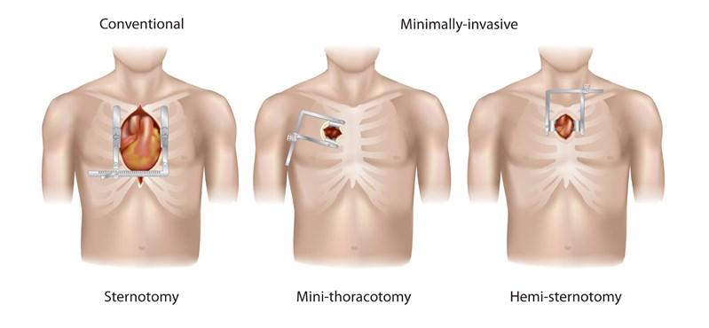

**1. Sternotomy**
  - **Process:** A full sternotomy involves making a vertical incision along the midline of the chest, followed by the division of the sternum, to provide wide access to the heart and lungs.
  - **Usage:** This approach is commonly used for various cardiac surgeries, such as coronary artery bypass grafting (CABG), valve replacements, and heart transplants.
  - **Advantages:** It provides extensive visibility and access to the thoracic structures.
  - **Disadvantages:** It involves a larger incision and can be associated with more pain and a longer recovery period post-surgery.
  
  
  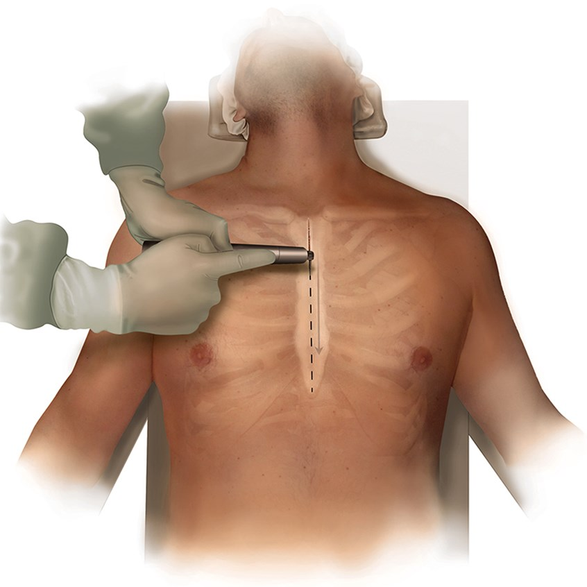
  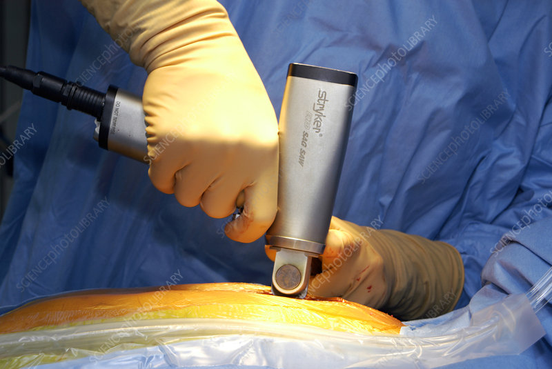
    
  In a standard procedure, following the sternotomy, the sternum is divided using a sternal saw. The sternum is then retracted using a sternal retractor. The surgeon dissects down to the pericardium, which is a fibrous sac that surrounds the heart. The pericardium is opened and retracted using a "stay" suture (_seen in image below_) for visaibility and access to the heart. The surgeon then performs the surgical procedure on the heart. Following the procedure, the pericardium is closed, the sternum is approximated, and the sternum is closed using sternal closure wires, cables, or plates.

  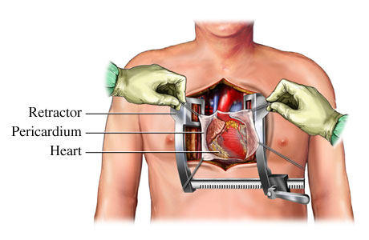

  

**2. Partial or Mini-Sternotomy:**
  - **Process:** A partial or mini-sternotomy involves making a smaller incision and dividing only a portion of the sternum, either the upper or lower part.
  - **Usage:** It is often utilized for minimally invasive valve surgery or CABG.
  - **Advantages:** It is associated with less pain, reduced blood loss, and a shorter recovery period compared to a full sternotomy.
  - **Disadvantages:** It may provide limited visibility and access compared to a full sternotomy.
  - **Types:**

  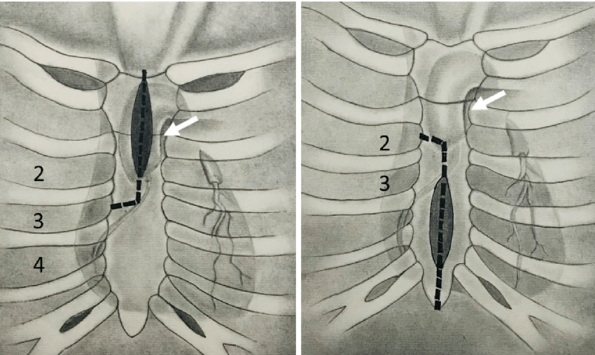
  

**3. Mini-Thoracotomy**

- **Process:** A mini-thoracotomy involves making a small incision between the ribs, without dividing the sternum, to access the heart.
- **Usage:** This approach is commonly used for minimally invasive valve surgeries, particularly for the aortic and mitral valves.
- **Advantages:** It is associated with less pain and a quicker recovery compared to a sternotomy. It also avoids the need to divide the sternum.
- **Disadvantages:** It provides limited access and visibility, and may not be suitable for more complex cardiac procedures.

  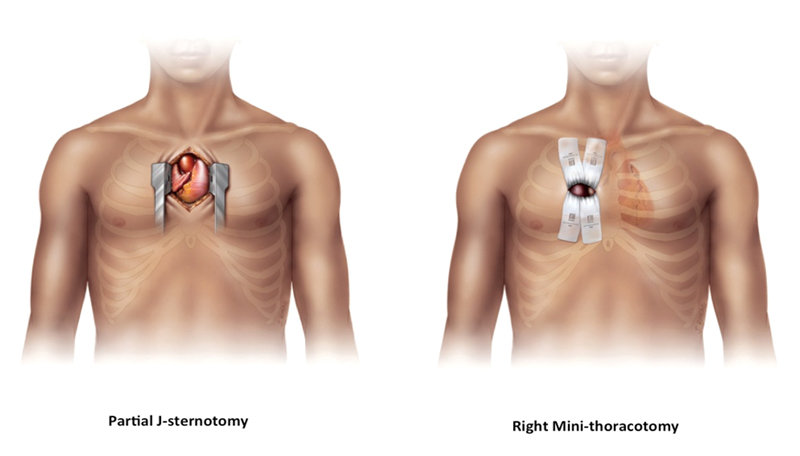

**Considerations for Surgical Access**

- **Patient Factors:** The patient’s anatomy, medical history, and the presence of any co-morbidities are considered when choosing the surgical approach.
- **Surgical Factors:** The type of surgery, the need for visibility and access, and the surgeon’s expertise influence the choice of access.
- **Recovery:** Minimally invasive approaches tend to be associated with less pain and a quicker recovery, but are not suitable for all types of surgeries.

In conclusion, the choice of cardiothoracic surgical access is multifaceted and tailored to each individual patient and surgical procedure. The surgeon will weigh the benefits and drawbacks of each approach to determine the most suitable method of access.

___

#### Key Concept: Endoscopic Vessel Harvesting (EVH)

Endoscopic Vessel Harvesting (EVH) is a minimally invasive technique used to harvest the saphenous vein for use as a graft in coronary artery bypass grafting (CABG) surgery. EVH is a preferred alternative to the traditional open vein harvesting (OVH) technique, which involves making a long incision along the length of the leg to access the saphenous vein (_everything I have ever seen has has been EVH. If the team has trouble getting the vein they switch to another vessel before pursuing an open harvest_).

##### How the EVH is performed in a CABG:

1. **Accessing the Saphenous Vein:**
   - The surgeon makes a small incision in the leg, usually in the groin or the knee, to access the saphenous vein.
   - A special endoscopic device is inserted through the incision and guided along the length of the vein.
   - The endoscope provides a magnified view of the vein and surrounding tissue, allowing the surgeon to identify and isolate the saphenous vein.

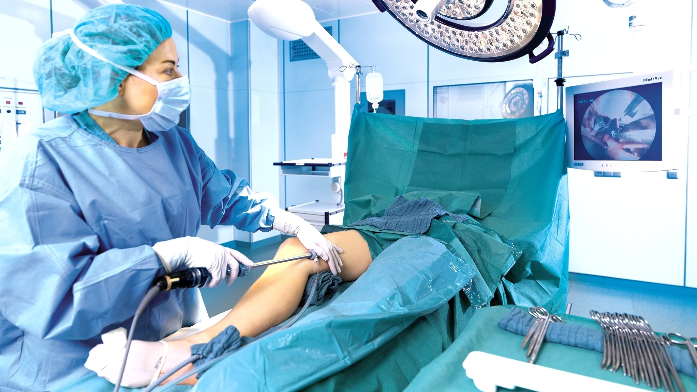
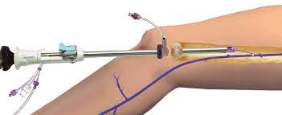
___
#### Key Concept: Internal Mammory Artery (IMA):

The **Internal Mammary Artery (IMA)** is commonly used in Coronary Artery Bypass Grafting (CABG) surgery, which aims to restore blood flow to the heart muscle when the coronary arteries are obstructed due to coronary artery disease.

##### Why IMA in CABG:
The IMA is a preferred vessel for grafting due to its proven long-term patency and positive clinical outcomes in CABG patients. When used as a graft, the IMA has demonstrated a better resistance to atherosclerosis and a longer survival rate compared to other graft types, such as saphenous vein grafts.

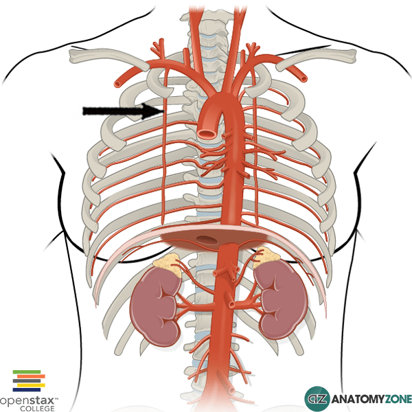

##### How IMA is used in CABG:

1. **Harvesting the IMA:**
   - The surgeon usually accesses the IMA through a median sternotomy, where the sternum is split open to provide access to the heart and the internal mammary artery.
   - The left internal mammary artery (LIMA) is most commonly used, although the right IMA can also be utilized depending on the surgeon's preference and the patient's anatomy.
   - The IMA is carefully dissected and released from its position alongside the inside of the chest wall.

2. **Choosing the Target Vessel:**
   - The surgeon identifies which of the coronary arteries will be bypassed. The choice often falls on the left anterior descending artery (LAD) if the LIMA is used due to its proximity and superior long-term patency rates.
   
3. **Performing the Bypass:**
   - The distal end of the harvested IMA is attached to the identified coronary artery beyond the site of the blockage.
   - The proximal end of the IMA (closer to the origin of the artery) is left attached to the subclavian artery, providing blood flow to the graft and subsequently to the coronary artery.
   - Through this bypass, the blood can flow around the blocked segment of the coronary artery, thus re-establishing perfusion to the heart muscle.

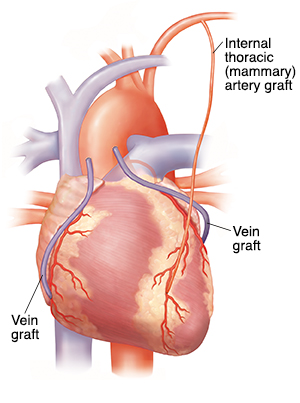

##### Advantages of using the IMA in CABG:

- **Superior Patency Rates:** IMA grafts tend to remain open and functional for a longer time compared to saphenous vein grafts.
- **Reduced Atherosclerosis:** The IMA is less prone to developing atherosclerosis, which is a common cause of graft failure.
- **Improved Survival:** Several studies have demonstrated improved long-term survival in patients who received an IMA graft during CABG.

____
#### Key Concept: Cardioplegia

**Introduction**

Cardioplegia is a technique used in cardiac surgery to induce cardiac arrest, allowing surgeons to operate on a still heart. This document elucidates the principles, mechanics, and considerations related to cardioplegia within the context of open-heart surgery.

##### 1. The Mechanism of Cardioplegia

- **Primary Components**
    - **Cardioplegic Solution**: A specialized solution that is infused into the heart to induce cardiac arrest.
    - **Delivery System**: A device that delivers the cardioplegic solution to the heart.

##### 2. Implementation of Cardioplegia in Surgery

- **Initiation**
    - The delivery system is connected to the heart, and the cardioplegic solution is infused.
    - The heart is arrested, and the surgeon can operate on a still heart.

##### 3. Antegrade vs. Retrograde Cardioplegia

- **Antegrade Cardioplegia**
    - The cardioplegic solution is infused into the coronary arteries, usually via the aortic root.
    - The solution flows in the same direction as the blood, hence the term “antegrade.”  

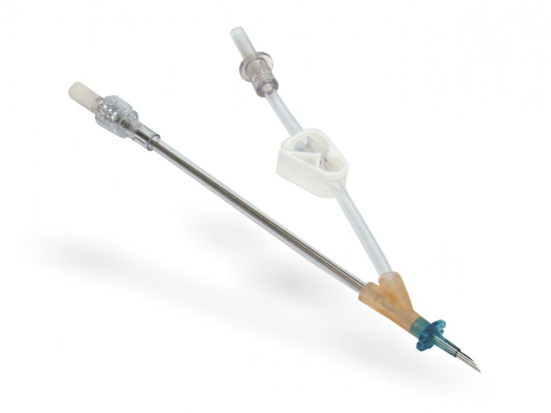

- **Retrograde Cardioplegia**
    - The cardioplegic solution is infused into the coronary sinus, which is located on the posterior side of the heart.
    - The solution flows in the opposite direction of the blood, hence the term “retrograde.”

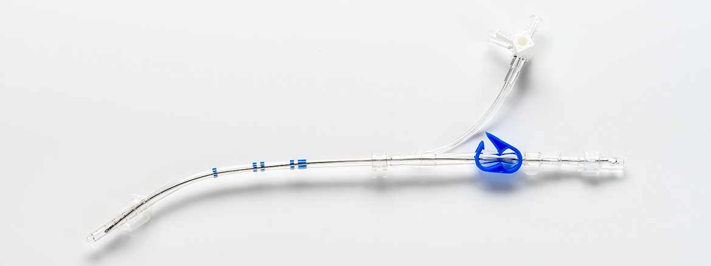
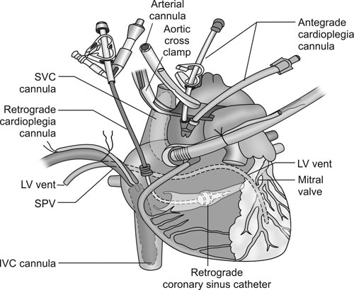

##### 4. Physiological and Pathophysiological Considerations

- **Myocardial Protection**
    - Cardioplegia protects the myocardium from ischemic damage during cardiac arrest.

##### 5. Components of Cardioplegic Solution

- **Potassium**
    - Potassium is the primary component of cardioplegic solution, as it is the primary ion responsible for depolarization of cardiac cells.
  - **Magnesium**
    - Magnesium is often added to cardioplegic solution, as it enhances the effects of potassium.
  - **Other Components**
    - Other components of cardioplegic solution include calcium, sodium, and glucose.
  - **Blood**
    - Blood is often added to cardioplegic solution to provide oxygen to the myocardium during cardiac arrest.

_____

#### Key Concept: Cardiopulmonary Bypass (CPB)

**Introduction**

Cardiopulmonary bypass (CPB), often referred to as heart-lung bypass, is a fundamental technique in cardiac surgery, facilitating a still and bloodless operative field. It performs the physiological roles of the heart and lungs, thereby permitting surgeons to operate on the heart while normal circulatory and respiratory functions are suspended. This document elucidates the principles, mechanics, and considerations related to CPB within the context of open-heart surgery.

##### 1. The Mechanism of Cardiopulmonary Bypass

- **Primary Components**
    - **Oxygenator**: Replaces pulmonary function by oxygenating blood and removing carbon dioxide.
      
    - **Pump**: Mimics the heart by propelling blood through the CPB circuit and into the patient’s circulatory system.
      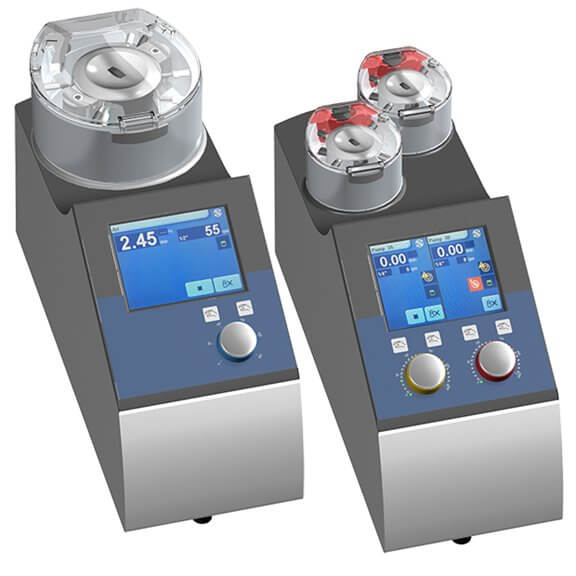
    - **Heat Exchanger**: Regulates the patient’s temperature during surgery, which may involve hypothermic techniques.
- **Functionality**
    - Blood is diverted from the heart to the CPB machine.
    - The pump propels the blood through the oxygenator and back into the patient’s circulation, bypassing the heart and lungs.
    
##### 2. Implementation of Cardiopulmonary Bypass in Surgery

- **Initiation**
    - Cannulation of the major vessels, typically the aorta and venae cavae, to divert blood from the heart.
    - Heparin is administered to prevent coagulation.
      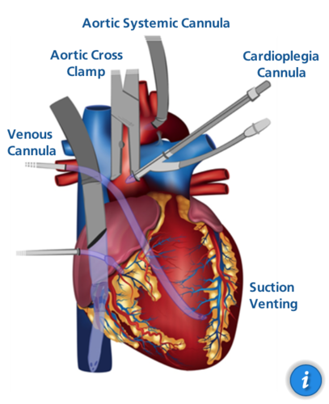
- **Maintenance**
    - Constant monitoring of parameters such as blood pressure, temperature, and oxygenation is crucial.
    - Hemodilution and temperature management strategies are employed to protect organs during the bypass.
- **Termination**
    - Gradual weaning off CPB while restoring independent cardiac function.
    - Reversal of anticoagulation, frequently using protamine.
    
##### 3. Open-Heart Surgery: Synchronized with CPB

- **Valve Surgeries and Repairs**
    - Facilitates operations on valves, enabling repairs or replacements.
- **Coronary Artery Bypass Grafting (CABG)**
    - Allows for the grafting of vessels to bypass coronary obstructions without the interference of circulating blood.
- **Congenital Defect Repairs**
    - Vital for addressing structural heart defects present from birth.
- **Heart Transplant**
    - A pivotal role in maintaining systemic perfusion during organ replacement.
    
##### 4. Physiological and Pathophysiological Considerations

- **Systemic Inflammatory Response**
    - CPB can induce an inflammatory response, implicating in post-operative complications.
- **Organ Perfusion**
    - Adequate perfusion and oxygenation of vital organs must be meticulously managed.
- **Coagulation**
    - The management of hemostasis and coagulation is paramount to prevent excessive bleeding or thrombotic events.

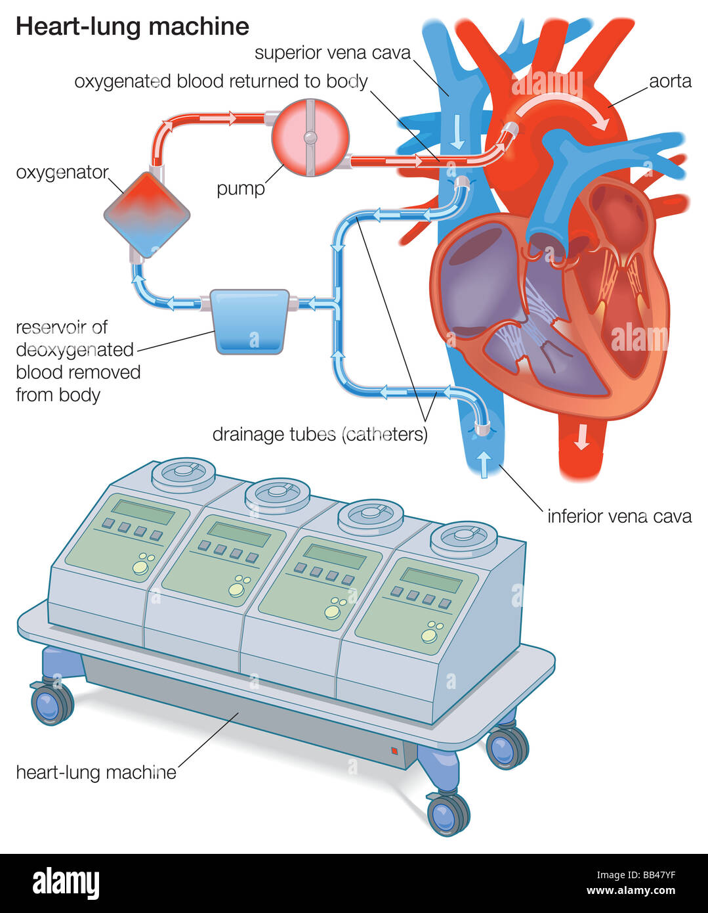    
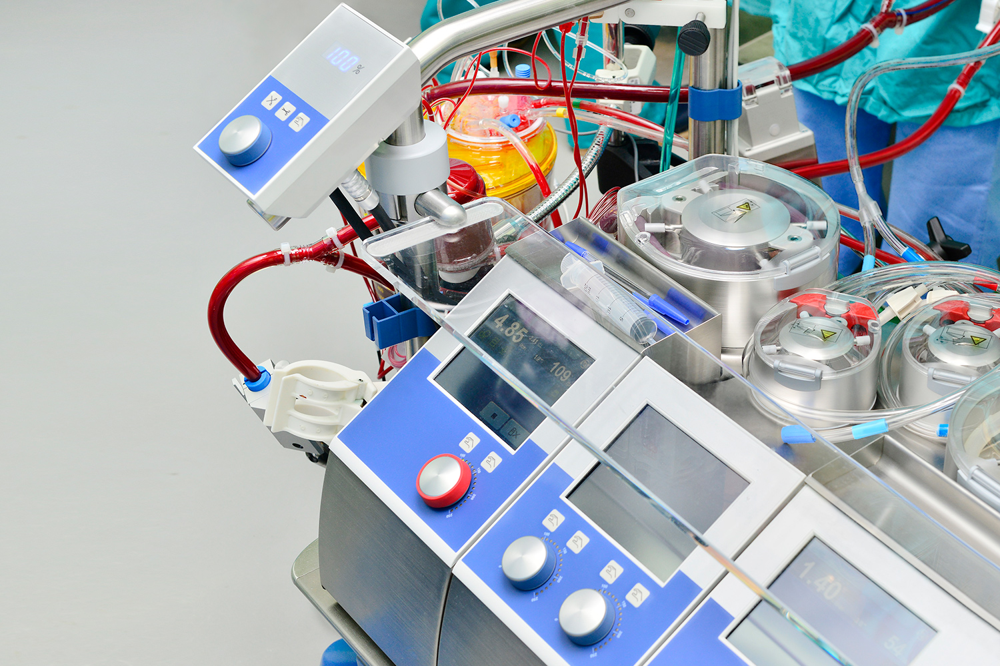

___

___

#### Key Concept: **Femoral Access for Open Heart Surgery and Femoral Cannulation**

Femoral access, particularly femoral cannulation, is a pivotal technique in open heart surgeries and procedures that require cardiopulmonary bypass (CPB). This approach allows for the circulation of blood via a heart-lung machine, bypassing the heart and maintaining perfusion to the rest of the body during surgery. It is often utilized in various cardiac interventions, including certain open heart surgeries, where direct aortic cannulation might be contraindicated or high-risk.

**Relevant Procuct Catagories:** `femoral arterial cannula`, `femoral venous cannula`

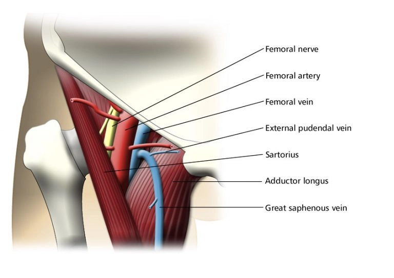
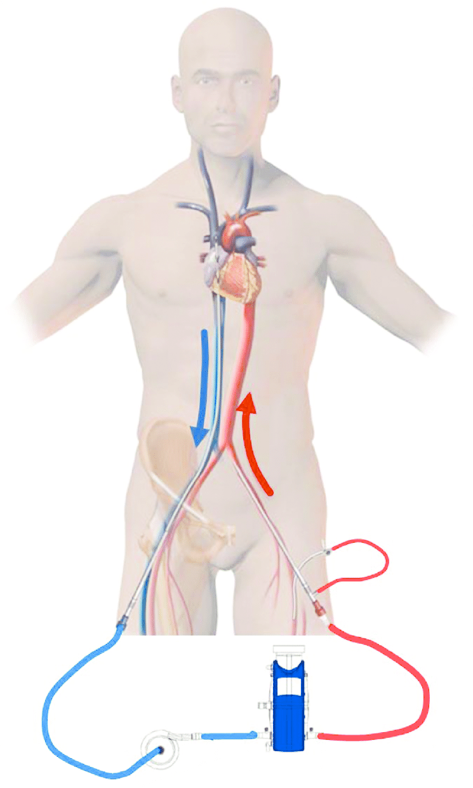
**Procedure of Femoral Cannulation**

1. **Preparation:**
   - **Positioning:** The patient is placed in a supine position, ensuring comfortable and safe access to the femoral region.
   - **Sterilization:** The groin area is cleaned and sterilized to prevent infection.
   - **Anesthesia:** Local or general anesthesia is administered based on the procedure.

2. **Femoral Vessel Access:**
   - **Exposure:** The femoral artery and vein are exposed via a small incision in the groin area.
   - **Cannulation:** Cannulas are inserted into the femoral artery and vein. The arterial cannula is utilized to deliver oxygenated blood from the heart-lung machine to the systemic circulation, while the venous cannula drains deoxygenated blood from the body to the machine.

3. **Cardiopulmonary Bypass (CPB):**
   - **Initiation:** Once cannulation is secured, CPB is initiated, diverting blood away from the heart and lungs, allowing for a still and bloodless surgical field.
   - **Maintenance:** The patient’s hemodynamics, including blood pressure, oxygenation, and acid-base balance, are meticulously monitored and managed during CPB.

4. **Surgical Procedure:**
   - **Intervention:** With the heart isolated from the systemic circulation, surgical interventions, such as valve repairs or coronary bypass, are performed.
   - **De-airing:** Before weaning from CPB, the heart is de-aired to prevent air embolism.

5. **Decannulation and Closure:**
   - **Weaning from CPB:** The patient is gradually weaned off the heart-lung machine, and the heart resumes its function.
   - **Decannulation:** The cannulas are removed, and the femoral vessels are repaired, typically with sutures.
   - **Closure:** The incision is closed meticulously to minimize infection risk and ensure optimal healing.

**Applications**

- **Emergent Situations:** Rapid establishment of CPB in emergencies, such as acute aortic dissection.
- **Minimally Invasive Cardiac Surgery:** Enabling procedures without the need for sternotomy.
- **High-Risk Patients:** Utilized when aortic cannulation is deemed risky due to calcification or other pathologies.

**Advantages**

- **Minimized Surgical Trauma:** Especially in minimally invasive cardiac surgeries.
- **Rapid Access:** Quick establishment of CPB in emergent situations.
- **Alternative Access:** Useful when other cannulation sites are not viable.

**Challenges and Risks**

- **Vascular Injury:** Risk of damage to the femoral vessels during cannulation.
- **Limb Ischemia:** Prolonged femoral artery cannulation may compromise limb perfusion.
- **Aortic Dissection:** Rare but serious complication, particularly during decannulation.

**Considerations**

- **Anatomical and Pathological Assessment:** Evaluating vessel size, patency, and the presence of atherosclerosis.
- **Technique Proficiency:** Ensuring skillful and gentle cannulation to minimize vascular trauma.
- **Patient Monitoring:** Continuous monitoring of limb perfusion and neurological status during CPB.

In essence, femoral access and cannulation serve as vital techniques in the armamentarium of cardiac surgeons and perfusionists, enabling safe and effective management of patients during complex cardiac procedures. The method demands a thorough understanding of the anatomy, meticulous technique, and vigilant patient monitoring to ensure optimal outcomes and minimize associated risks.

____

#### Key Concept: **Proximal and Distal Anastomosis in Coronary Artery Bypass Grafting (CABG)**

Coronary Artery Bypass Grafting (CABG) is a surgical procedure aimed at improving blood flow to the myocardium by bypassing occluded coronary arteries. This is achieved by creating new pathways for blood flow using grafts, which are often vessels harvested from other parts of the patient's body. The process of attaching the graft involves creating connections, or anastomoses, at two points: proximal and distal to the occlusion.

**Relevant Procuct Catagories:** `coronary needle holders - proximal`, `coronary needle holders - distal`, `coronary scissors`, `delicate forceps`, `aortic punch`

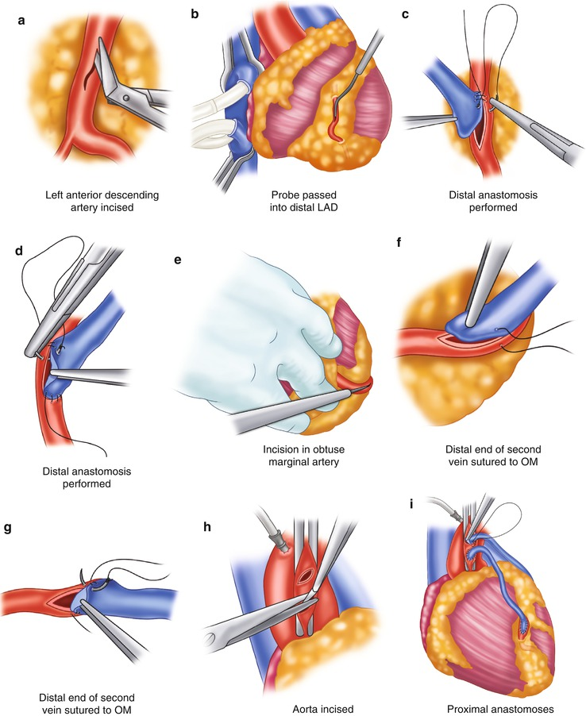

**1. Proximal Anastomosis**

- **Definition:** Proximal anastomosis refers to the connection of the graft to a major artery, which is typically the aorta, to ensure a robust and oxygen-rich blood supply to the graft.
  
- **Procedure:**
  - **Location Identification:** A suitable site on the aorta is identified for anastomosis.
  - **Arteriotomy:** A small incision is made in the wall of the aorta, often using a surgical aortic punch.
  - **Graft Attachment:** The graft (like the saphenous vein) is sutured to the aorta, establishing the proximal anastomosis.
  
- **Considerations:**
  - **Aortic Health:** The health and calcification level of the aorta must be considered to ensure a secure anastomosis.
  - **Hemodynamic Stability:** Maintaining patient stability during clamping and suturing on the aorta.

**2. Distal Anastomosis**

- **Definition:** Distal anastomosis involves connecting the other end of the graft to the coronary artery, beyond the point of occlusion, to restore blood flow to the myocardium.

- **Procedure:**
  - **Target Artery Identification:** The occluded coronary artery segment is identified.
  - **Arteriotomy:** A small incision is made in the coronary artery, distal to the blockage.
  - **Graft Attachment:** The graft is sutured to the coronary artery, forming the distal anastomosis.
  
- **Considerations:**
  - **Coronary Artery Condition:** Ensuring the target site is free from extensive disease to secure the anastomosis.
  - **Blood Flow Restoration:** Confirming successful restoration of blood flow to the myocardium post-anastomosis.

**Challenges and Risks**

- **Graft Patency:** Ensuring the graft remains open and functional over time.
- **Technical Precision:** Ensuring accurate and secure suturing to prevent complications like bleeding or graft failure.
- **Myocardial Protection:** Safeguarding the myocardium during the procedure, especially during periods of ischemia.

**Postoperative Considerations**

- **Graft Surveillance:** Monitoring graft patency and cardiac function using imaging studies postoperatively.
- **Patient Recovery:** Managing pain, monitoring for complications, and facilitating rehabilitation.
- **Long-Term Management:** Addressing risk factors and implementing lifestyle and pharmacological interventions to optimize graft longevity and cardiac health.

In CABG, both proximal and distal anastomoses are critical steps that require surgical precision and expertise to ensure the successful re-establishment of blood flow to the myocardium, thereby enhancing cardiac function and patient outcomes. The procedure demands meticulous planning, technical proficiency, and comprehensive postoperative management to optimize long-term graft patency and overall cardiac health.

___

#### Key Concept: **Off-Pump Coronary Artery Bypass (OPCAB) Procedures**

Off-Pump Coronary Artery Bypass (OPCAB), often referred to as "beating heart surgery," is a technique of performing coronary artery bypass grafting (CABG) without the use of cardiopulmonary bypass (CPB) – the heart-lung machine. This approach allows surgeons to perform bypass surgery while the heart is still beating, thereby avoiding potential complications associated with CPB. Typically the perfusion team is still there, on site, ready to go on pump if needed.

The most common consideration for doing an off-pump CABG is due to heavy calcification in the Aorta. The surgeon factors that variable in, amongst a host of others, and makes a decsision. Sometimes the risk of calcium embolism is too high and the surgeon will opt for an off-pump CABG. An embolism occures wehn a piece of calcium breaks off and travels to the brain or other organs. This can cause a stroke or other ischemic complications.

**Relevant Procuct Catagories:** `coronary needle holders - proximal`, `coronary needle holders - distal`, `coronary scissors`, `delicate forceps`, `aortic punch`, `stabilizer`, `saphenous vein harvester`, `proximal anastomosis assist device`

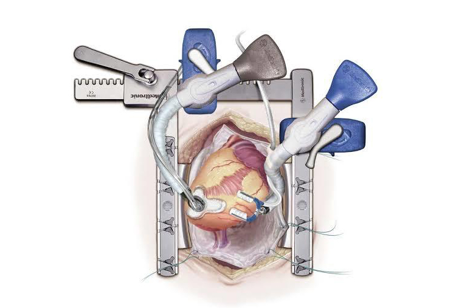

**Procedure of OPCAB**

1. **Preparation:**
   - **Access:** The heart is accessed typically through a median sternotomy, providing a direct view of the heart.
   - **Stabilization:** A stabilizer is used to steady the portion of the heart where the grafting is to be performed, while the rest of the heart continues to beat and circulate blood.

2. **Graft Harvesting:**
   - **Vessel Selection:** Suitable vessels (like the saphenous vein or internal mammary artery) are harvested to serve as grafts.
   
3. **Performing Anastomoses:**
   - **Distal Anastomosis:** The graft is attached to the coronary artery beyond the blockage while the heart is beating.
   - **Proximal Anastomosis:** The other end of the graft is connected to a major artery, often the aorta.

4. **Graft Verification:**
   - **Flow Measurement:** The flow through the newly placed graft is measured to ensure it is functioning adequately.
   - **Visual Inspection:** The graft and anastomoses are inspected for any issues like bleeding.

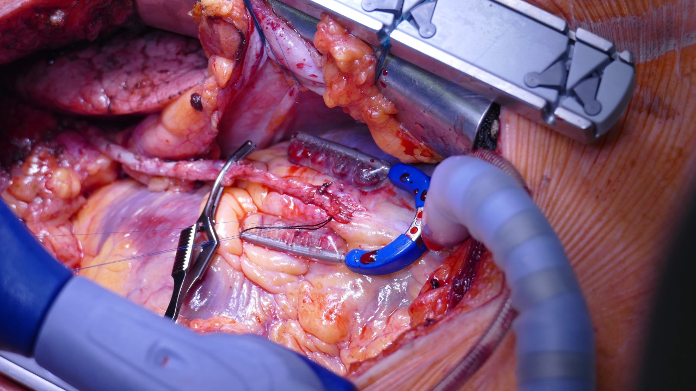

**Applications**

- **High-Risk Patients:** It may be preferred in patients where CPB might pose significant risks, such as in individuals with renal dysfunction, pulmonary issues, or atheromatous aortic disease.

**Advantages**

- **Reduced Complications:** OPCAB often associates with fewer neurological complications, less renal impairment, and lower mortality in specific patient subsets.
- **Avoidance of CPB:** Eliminates complications related to the use of the heart-lung machine, such as systemic inflammatory response and potential air or particle embolism.
- **Shorter Recovery:** Often, patients experience a quicker recovery and shorter hospital stay compared to on-pump CABG.

**Challenges and Risks**

- **Technical Difficulty:** Performing anastomoses on a beating heart demands high surgical skill and expertise.
- **Limited Revascularization:** In some cases, it might be challenging to achieve complete revascularization, especially in patients with multiple vessel disease.
- **Hemodynamic Instability:** Manipulating the heart during surgery can sometimes lead to hemodynamic instability, which must be meticulously managed.

**Considerations**

- **Patient Selection:** Careful selection of suitable candidates for OPCAB is crucial to optimize outcomes.
- **Surgical Expertise:** Surgeons must be adept at performing precise anastomoses on the beating heart.
- **Intraoperative Management:** Ensuring stable hemodynamics and adequate myocardial protection during the procedure.

In summary, OPCAB offers a viable alternative to conventional on-pump CABG, particularly for certain patient populations, providing the benefits of reduced complications and quicker recovery. The approach, while technically demanding, can yield excellent outcomes with meticulous surgical technique, thorough patient selection, and comprehensive intraoperative management.

____
#### Key Concept: Temporary Pacing

Temporary pacing involves the insertion of a pacing wire into the heart to regulate the heart rate. It is a common procedure in cardiac surgery, where it is used to maintain a normal heart rate during and after surgery.

##### Why Temporary Pacing is used in Cardiac Surgery:

Temporary pacing is used in cardiac surgery to maintain a normal heart rate during and after surgery. It is often used in conjunction with cardiopulmonary bypass (CPB), which is a technique that temporarily takes over the function of the heart and lungs during surgery. CPB is used in cardiac surgery to provide a still and bloodless operative field, facilitating the surgical procedure. However, CPB can cause arrhythmias, which are abnormal heart rhythms. Temporary pacing is used to regulate the heart rate and prevent arrhythmias during and after CPB.

##### Atrial Pacing vs. Ventricular Pacing:

**Atrial Pacing Wires** - are typically placed epicardially on the right atrium. They are used to pace the atrium, which is the upper chamber of the heart. Atrial pacing wires are used to maintain a normal heart rate during and after surgery. Many surgeons are more selective on the utilization of atrial pacing, and often only use atrial pacing on a patient who is "pacing dependent". That said, other surgeons use atrial pacing wires in their standard protocol.

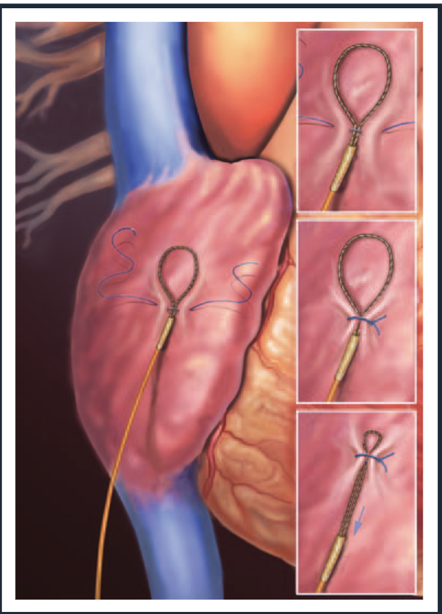

**Ventricular Pacing Wires** - are typically placed in the myocardium of the right ventricle. They are used to pace the ventricle, which is the lower chamber of the heart. Ventricular pacing wires are used to maintain a normal heart rate during and after surgery. Ventricular pacing is more commonly used than atrial pacing, as it is more effective at maintaining a normal heart rate.

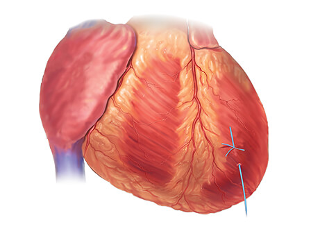
____
#### Key Concept: Hemostasis Products used in Cardiac Surgery

Hemostasis is a very complex topic. It is not an immediate focus of our current products, but should be understood at the surface level to understand what is happening in the room. 

The patient is often given a dose of Heparin to prevent blood clots from forming during the procedure. This is a very important step. The patient is then given a dose of Protamine to reverse the effects of the Heparin.

The nuance and complexities of the patient and the case can cause bleeding issues sometimes with patients. Depending on the severity, different products are used to assist with hemostasis.

Blood products from the OR blood bank are often used to assist with hemostasis. These will often be units of blood, platelets, and less frequently factor 7 (a specific catalyst in the clotting cascade).

Other products used to assist with hemostasis are topical hemostatic agents. These are products that are applied to the surgical site to assist with hemostasis. These products are often used in conjunction with the blood products from the blood bank.

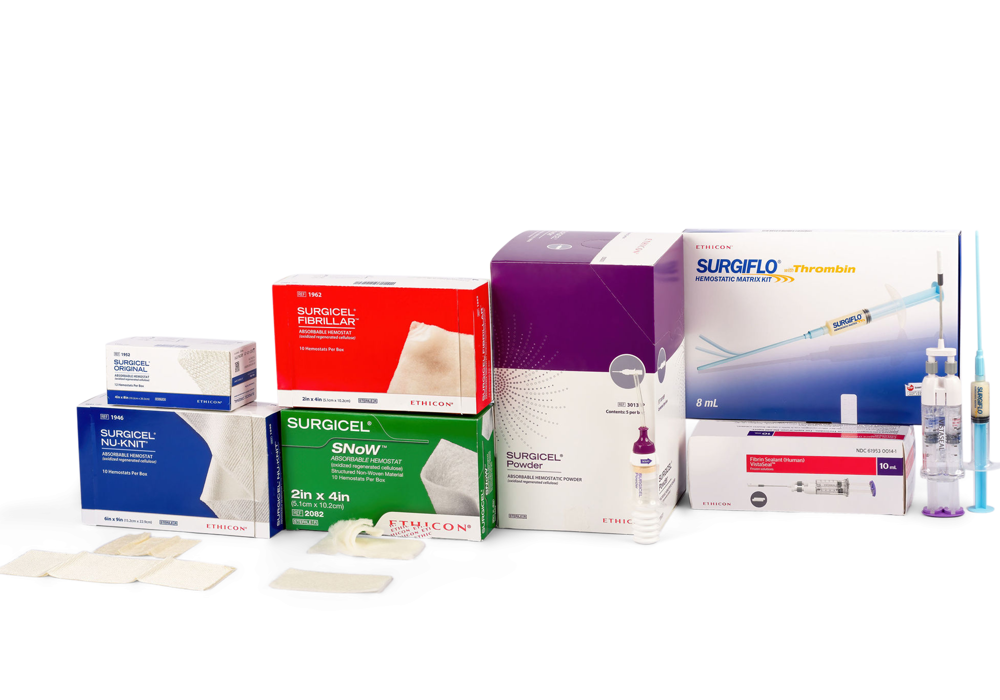

**1. Topical Hemostatic Agents**

- **Gelatin-Based Hemostats:**
  - **Mechanism:** Provide a porous matrix that accelerates clot formation and platelet activation.
  - **Usage:** Often used in surface oozing and bleeding from raw tissue surfaces.
- **Collagen-Based Hemostats:**
  - **Mechanism:** Act as a scaffold for platelet adhesion and aggregation, initiating the intrinsic clotting pathway.
  - **Usage:** Applied to bleeding surfaces, especially where coagulation might be suboptimal.
- **Fibrin Sealants:**
  - **Mechanism:** Mimic the final stages of the coagulation cascade, providing a fibrin clot at the site of application.
  - **Usage:** Used to seal suture lines, adhere tissues, and provide targeted hemostasis.

**2. Hemostatic Patches and Dressings**

- **Oxidized Regenerated Cellulose:**
  - **Mechanism:** Provides a matrix for clot formation and possesses antibacterial properties.
  - **Usage:** Applied to bleeding surfaces, especially in areas difficult to suture.
- **Polyethylene Glycol (PEG) Sealants:**
  - **Mechanism:** Form a synthetic, hydrogel barrier to control bleeding.
  - **Usage:** Used to seal suture lines and provide a barrier to oozing surfaces.

**3. Flowable Hemostats**

- **Flowable Gelatin:**
  - **Mechanism:** Gelatin particles suspended in a thrombin solution, providing a matrix and enzymatic action to promote clotting.
  - **Usage:** Used in irregular or deep surgical sites where standard hemostats may be ineffective.
- **Cyanoacrylate Glues:**
  - **Mechanism:** Rapid polymerization upon contact with blood or tissue, providing a physical barrier to bleeding.
  - **Usage:** Used to seal suture lines and control bleeding from small vessels.

**Applications and Considerations**

- **Surgical Application:** Hemostatic agents are utilized to control bleeding from suture lines, graft anastomoses, and tissue surfaces.

___

#### Key Concept: **Post-Operative Drainage in Cardiac Surgery - Chest Tubes**

Following a cardiac operation, chest tubes are often placed to drain fluid and air from the chest cavity. Chest tubes are typically connected to a drainage system, which allows for the collection of fluid and air from the chest cavity. The drainage system is often connected to a suction device, which helps to remove fluid and air from the chest cavity.

Tubes are placed in the chest cavity near the end of the procedure, the one end of the tube being passed through the pateints skin.

**Relevant Procuct Catagories:** `chest tube`, `chest tube drainage system`

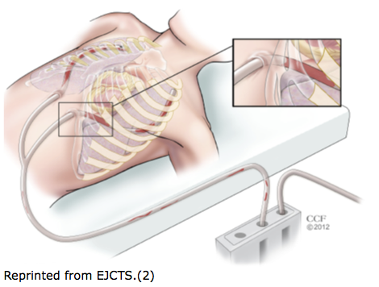
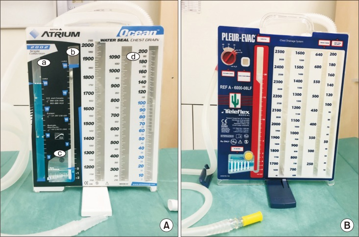

Chest tubes are typically placed in the pleural space, which is the space between the lungs and the chest wall.

The chest tubes stay with the patient, and are removed in the ICU during the recovery period. The chest tubes are removed when the drainage is minimal and the patient is stable.

___

#### Key Concept: **Sternal Closure in Cardiac Surgery**

Sternal closure is a critical phase in cardiac surgery, following intrathoracic procedures, where the sternum, which has been surgically divided or entered, is securely closed to ensure stability, promote healing, and prevent complications. This process is vital for protecting underlying structures like the heart and lungs and providing structural integrity during the recovery period.

**Procedure of Sternal Closure**

1. **Alignment (Approximation):**
   - **Positioning:** The two halves of the sternum are aligned accurately to ensure proper healing and to minimize the risk of non-union or malunion.
   - **Stability:** Ensuring that the sternum is stable and that there is no excessive movement at the closure site.

2. **Fixation:**
   - **Wire Placement:** Traditional method. Stainless steel wires are commonly used to approximate and stabilize the sternum. The wires are passed around the sternum and tightened to secure the two halves together.
   - **Sternal Plating:** More recently, additional fixation devices like sternal plates may be used, especially in patients with associated risk factors.

##### Benefits of Sternal Plates in Cardiac Surgery

Sternal plates are utilized in cardiac surgery as a method for sternal closure and stabilization, particularly in situations where traditional wire closure may not be optimal. These plates, often made from titanium, are designed to provide rigid fixation of the sternum, facilitating healing and providing stability. Here are some of the notable benefits of using sternal plates:

##### 1. Enhanced Stability
- **Rigid Fixation:** Sternal plates provide a more rigid fixation compared to wires, reducing sternal micromotion.
- **Support:** They offer robust structural support, especially in patients with compromised bone quality.

##### 2. Improved Healing
- **Alignment:** Plates ensure accurate alignment of the sternal edges, promoting optimal healing.
- **Reduced Stress:** By providing stable fixation, sternal plates may reduce stress on the healing bone, minimizing the risk of non-union or malunion.

##### 3. Reduced Post-Operative Pain
- **Stability Minimizes Pain:** The stability offered by sternal plates can potentially minimize post-operative pain caused by sternal instability.
- **Improved Respiratory Mechanics:** Reduced pain may facilitate better respiratory mechanics, enabling patients to breathe deeply and cough more effectively after surgery, which is crucial for preventing post-operative pneumonia.

##### 4. Beneficial in High-Risk Populations
- **Osteoporotic Patients:** In patients with osteoporosis or poor bone quality, sternal plates can provide enhanced stability and support.
- **Obese Patients:** In obese patients, where increased mechanical stress is placed on the sternum, plates can offer additional stability.
- **Re-Operations:** In cases of re-operation, where the sternum may be compromised, sternal plates can provide secure closure.

##### 5. Potential for Reduced Complications
- **Decreased Risk of Sternal Dehiscence:** The rigid fixation provided by sternal plates may reduce the risk of sternal dehiscence.
- **Lower Infection Rates:** Some studies suggest that the use of sternal plates may be associated with lower rates of deep sternal wound infections, particularly in high-risk populations.

##### 6. Facilitation of Early Mobilization
- **Confidence in Movement:** The stability provided by sternal plates may give patients confidence in moving and mobilizing early post-operation.
- **Physical Therapy:** It may facilitate physical therapy and rehabilitation by providing a stable sternum, allowing patients to engage more effectively in exercises and activities.

##### Conclusion
While sternal plates offer numerous benefits, especially in specific patient populations, it's crucial to weigh these against the potential risks and costs associated with their use. The decision to utilize sternal plates should be based on a comprehensive assessment of the patient’s risk factors, the surgical context, and the potential advantages they offer in each specific case.

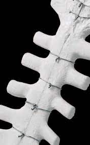
## VS
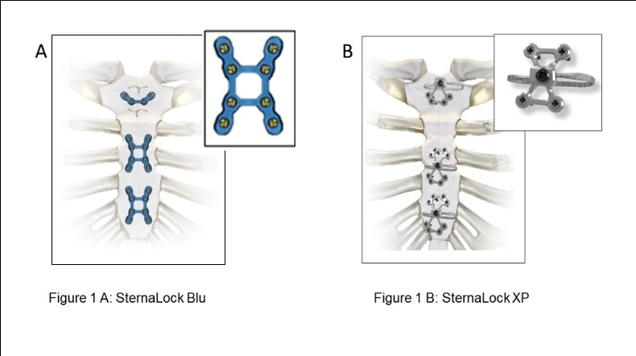

<embed src="../../static/pdf/white_paper_the_sternalock_blu.pdf" type="application/pdf" width="1000px" height="800px">

**Challenges and Risks**

- **Infection:** Sternal wound infections are a significant concern and can have serious implications.
- **Non-Union:** Inadequate closure or patient factors may lead to non-union of the sternum, requiring further intervention.
- **Chronic Pain:** Some patients may experience chronic pain at the sternal closure site.

**Considerations**

- **Patient Factors:** Considering factors like diabetes, obesity, and osteoporosis which may affect healing and stability.
- **Technique:** Ensuring that the closure technique is appropriate for the patient and the procedure.
- **Post-Operative Care:** Providing adequate pain management, monitoring for signs of infection, and ensuring stability of the sternum during recovery.

In essence, sternal closure is a fundamental component of cardiac surgery, providing both a protective barrier for intrathoracic structures and structural stability during the post-operative period. The technique demands execution and thorough post-operative care to minimize complications and optimize patient recovery and outcomes.

___

#### Key Concept: **Aortic Dissections & Induced Hypothermia**

Aortic dissection is a serious condition where the inner layer of the aorta tears, allowing blood to flow between the layers of the aortic wall, forcing the layers apart. In the context of surgical repair of aortic dissections, induced hypothermia is often utilized as a protective strategy to safeguard organ function, particularly the brain and spinal cord, during periods of reduced or interrupted blood flow.

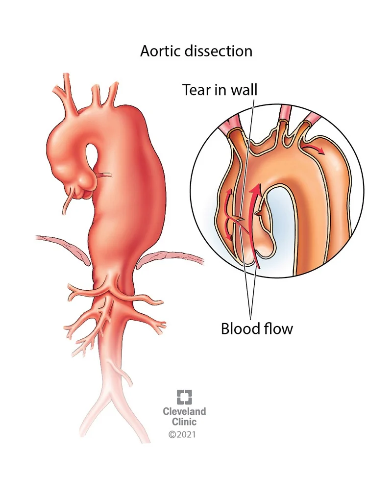
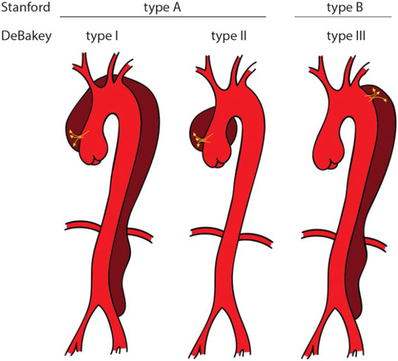

**Aortic Dissections: An Overview**

- **Type A:** Involves the ascending aorta and possibly the descending aorta. It's typically treated surgically due to its high risk of rupture.
- **Type B:** Involves only the descending aorta and is often managed medically unless complications arise.
  
**Induced Hypothermia: A Protective Strategy**

1. **Mechanism:**
   - **Metabolic Reduction:** Lowering the body temperature reduces metabolic demand, particularly of the central nervous system.
   - **Protective Effect:** Provides protection against ischemic injury during periods of reduced blood flow.

2. **Procedure:**
   - **Cooling:** The patient’s body temperature is lowered using cooling blankets, ice packs, or other specialized devices.
   - **Monitoring:** Continuous monitoring of core body temperature, ensuring it is maintained at the desired level.
   - **Rewarming:** Gradual rewarming post-procedure to prevent complications associated with rapid temperature changes.

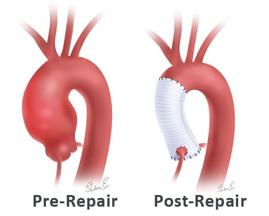

**Applications in Aortic Dissection Repair**

- **Cerebral Protection:** During repair of Type A dissections, especially involving the arch, hypothermia is used to protect the brain during periods of circulatory arrest.
- **Spinal Cord Protection:** In Type B dissections, particularly during endovascular repair, hypothermia may be used to protect the spinal cord from ischemia.
  
**Advantages**

- **Organ Protection:** Minimizes ischemic injury to vital organs, particularly the brain and spinal cord, during surgery.
- **Extended Tolerance:** Allows for longer periods of circulatory arrest or reduced blood flow during complex repairs.

**Challenges and Risks**

- **Coagulation Impact:** Hypothermia can impact coagulation, potentially increasing the risk of bleeding.
- **Arrhythmias:** The risk of cardiac arrhythmias may be elevated during cooling and rewarming phases.
- **Metabolic Effects:** Electrolyte imbalances and metabolic alterations can occur during induced hypothermia.

In summary, induced hypothermia is a valuable tool in the surgical management of aortic dissections, providing crucial protection to vital organs during periods of reduced or interrupted blood flow. 

____

#### Key Concept: **Minimally Invasive Aortic Valve Replacement (Mini-AVR)**

Minimally Invasive Aortic Valve Replacement (Mini-AVR) represents a paradigm shift in cardiac surgery, prioritizing smaller incisions and specialized techniques to replace the aortic valve with reduced surgical trauma. This approach aims to offer a viable alternative to traditional open-heart surgery, potentially minimizing recovery times and post-operative complications.

**Procedure Overview**

1. **Accessing the Heart:**
   - **Incision:** A smaller incision, often between 2-4 inches, is made, typically through a mini-sternotomy or a right anterior mini-thoracotomy.
   - **Visualization:** Enhanced visualization is often achieved through specialized instruments and endoscopic assistance.

2. **Valve Replacement:**
   - **Exposure:** The aortic valve is exposed while ensuring minimal disruption to surrounding structures.
   - **Removal:** The diseased aortic valve is carefully excised.
   - **Implantation:** A prosthetic valve is implanted in place of the native valve.

3. **Closure:**
   - **Verification:** Proper placement and function of the new valve are verified.
   - **Closing:** The incision is meticulously closed, ensuring structural integrity.

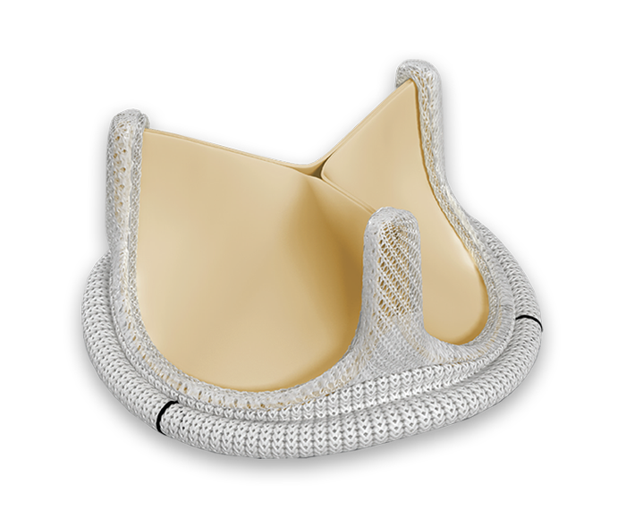
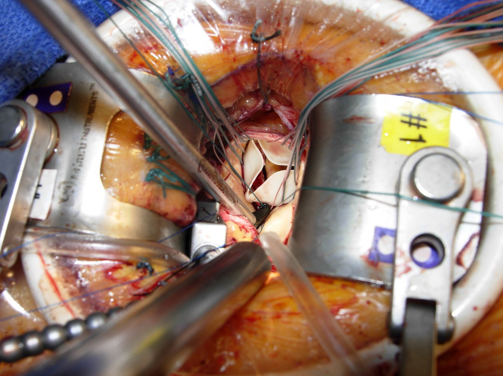

**Applications**

- **Aortic Stenosis:** Mini-AVR can be utilized to replace a narrowed aortic valve.
- **Aortic Regurgitation:** It may also be applied to address a valve that is leaking or not closing properly.

**Advantages**

- **Reduced Trauma:** Smaller incisions and reduced tissue disruption minimize surgical trauma.
- **Shorter Recovery:** Patients often experience quicker recovery and shorter hospital stays.
- **Less Pain:** Typically, patients report less post-operative pain compared to traditional approaches.
- **Improved Cosmesis:** Smaller, more strategically placed incisions offer better cosmetic outcomes.
- **Lower Blood Loss:** Minimally invasive approaches often result in reduced intraoperative bleeding.

**Challenges and Risks**

- **Technical Demands:** The procedure demands advanced surgical skills and familiarity with specialized instruments.
- **Limited Exposure:** The smaller incision provides limited visual and physical access to the surgical field.
- **Patient Selection:** Not all patients are suitable candidates for Mini-AVR, and thorough pre-operative assessment is crucial.
- **Complication Management:** Managing complications may be challenging due to the restricted surgical field.

**Considerations**

- **Surgical Expertise:** Ensuring the surgical team is proficient in minimally invasive techniques.
- **Equipment:** Availability and familiarity with specialized instruments and equipment.
- **Patient Factors:** Comprehensive assessment to ensure the patient is a suitable candidate for Mini-AVR.
- **Post-Operative Care:** Ensuring that post-operative care protocols are optimized for recovery from minimally invasive surgery.

In essence, Mini-AVR offers a less invasive alternative for aortic valve replacement, potentially providing numerous benefits in terms of recovery, pain, and cosmesis. However, the approach demands specific surgical expertise, equipment, and careful patient selection to ensure optimal outcomes and manage inherent challenges.

___

#### Key Concept: **Minimally Invasive Mitral Valve Repair (Mini-MVR)**

Minimally Invasive Mitral Valve Repair (Mini-MVR) is an advanced surgical technique that aims to repair a dysfunctional mitral valve through smaller incisions and specialized instruments, minimizing surgical trauma and potentially offering a range of patient benefits compared to traditional open-heart approaches.

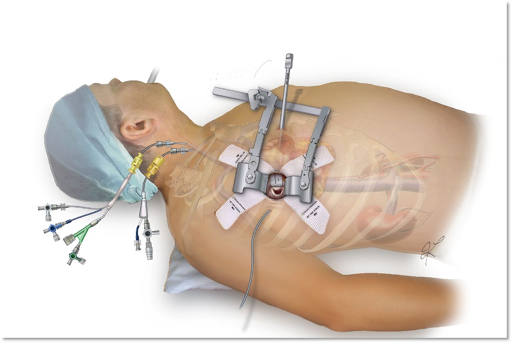

**Procedure Overview**

1. **Accessing the Mitral Valve:**
   - **Incision:** A small incision, often in the right lateral thorax, is made to access the heart while avoiding a full sternotomy.
   - **Visualization:** Endoscopic or robotic assistance is utilized to enhance visualization of the mitral valve through the smaller incision.

2. **Valve Repair:**
   - **Exposure:** The mitral valve is exposed, often utilizing specialized retractors and instruments.
   - **Repair Techniques:** Depending on the pathology, various repair techniques such as annuloplasty, leaflet repair, or chordal replacement might be employed.
   - **Testing:** The repair is tested intraoperatively using saline or echocardiography to ensure valve competence.

3. **Closure:**
   - **Verification:** Ensuring the stability and functionality of the repair.
   - **Closing:** The incision is closed, prioritizing structural integrity and cosmetic appearance.

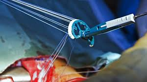

**Applications**

- **Mitral Regurgitation:** Addressing backward flow of blood due to a leaking mitral valve.
- **Mitral Stenosis:** Repairing or modifying a narrowed mitral valve to enhance blood flow.

**Advantages**

- **Reduced Surgical Trauma:** Smaller incisions and minimized tissue disruption reduce overall surgical trauma.
- **Quicker Recovery:** Often associated with shorter hospital stays and quicker return to normal activities.
- **Less Post-Operative Pain:** Typically, patients experience less pain and require fewer analgesics post-operatively.
- **Improved Cosmesis:** Smaller, more strategically placed incisions result in better cosmetic outcomes.
- **Reduced Blood Loss:** The minimally invasive approach tends to involve less blood loss and lower transfusion requirements.

**Challenges and Risks**

- **Technical Complexity:** Mini-MVR demands advanced surgical skills and proficiency with specialized instruments.
- **Limited Visualization:** The restricted surgical field can limit direct visualization and access.
- **Patient Suitability:** Thorough pre-operative assessment is crucial to determine patient suitability for a minimally invasive approach.
- **Complication Management:** Addressing intraoperative complications can be challenging due to limited access.

___

#### Key Concept: **Minimally Invasive Coronary Artery Bypass Grafting (Mini-CABG)**

Minimally Invasive Coronary Artery Bypass Grafting (Mini-CABG) is a refined approach to traditional CABG surgery, aiming to revascularize the myocardium through smaller incisions and without the need for cardiopulmonary bypass (off-pump) in certain cases, thereby reducing surgical trauma and potentially offering a spectrum of benefits to the patient.

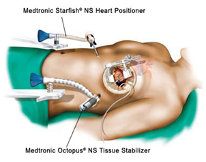

**Procedure Overview**

1. **Accessing the Heart:**
   - **Incision:** A smaller incision, often through a mini-thoracotomy, is made to access the heart, avoiding a full sternotomy.
   - **Visualization:** Enhanced visualization is achieved through endoscopic or robotic assistance.

2. **Graft Harvesting and Preparation:**
   - **Harvesting:** Conduits for bypass, such as the internal mammary artery or saphenous vein, are harvested, potentially using endoscopic techniques.
   - **Preparation:** The grafts are prepared for anastomosis to the coronary arteries.

3. **Performing the Bypass:**
   - **Target Vessel Identification:** The coronary artery to be bypassed is identified and prepared.
   - **Anastomosis:** The graft is anastomosed to the coronary artery, bypassing the occlusion.
   - **Flow Verification:** Intraoperative assessment, often using flowmetry or imaging, ensures graft patency and adequate revascularization.

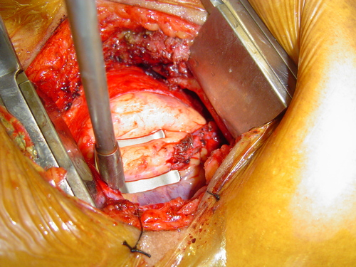

