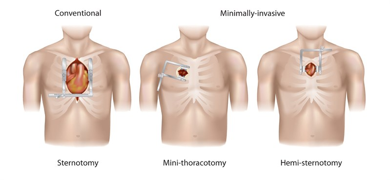
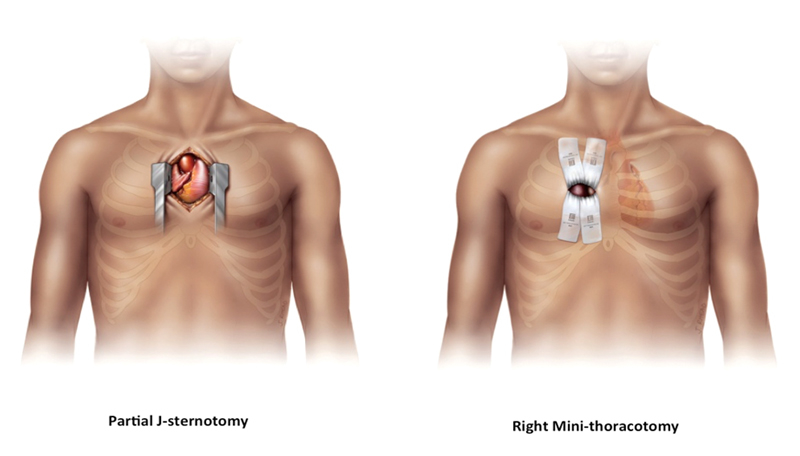
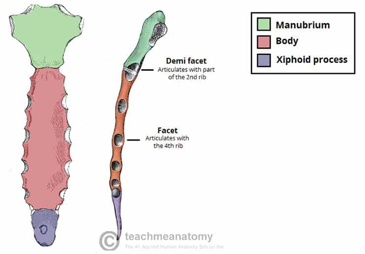
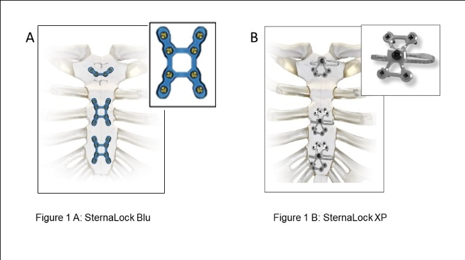

# Prime Surgical
## Knowledge & Training 
### Zimmer Biomet Portfolio

### Table of Contents

1. Resources
2. CV Foundational Review
3. Portfolio Overview
   1. Sternal Plating
      1. Sternalock Blu
      2. Sternalock XP
      3. Sternalock 360
      4. Sternalock EZ
   2. Single-Use Items
  

### Resources

`path to icloud zb root directory`
`airtable zb base`
`loop`
`key zimmer contacts`
`zb billing process & contacts`

## CV

A large part of the Zimmer portfolio comes from the broader category of `sternal closure`, which is the process of closing the sternum after a sternotomy. A sternotomy is a surgical procedure that involves cutting through the sternum (breastbone) to access the thoracic cavity. This is a common procedure for heart surgery, and is the most commonly done with a CABG (coronary artery bypass grafting).

Traditionally, cardiac surgeons used stainless steel sternal wires to close the sternum. More recently, new technologies have been released to optimize the patients recovery, and reduce the risk of complications. These new technologies include `sternal plating systems`, `sternal cable systems`, and `double wire`.

Additionaly, the growing portfolio includes a number of single-use items, such as `atrial and ventricular pacing wires`, `temporary pacing cables`, and a `punch`.

### Sternal Closure

##### Key Concept: **Cardiothoracic Surgical Access**

Cardiothoracic surgical access refers to the methods and approaches used by surgeons to gain access to the heart and surrounding structures within the thoracic cavity. The choice of surgical access is determined by various factors, including the type of cardiac surgery being performed, the patient's anatomy, and the surgeon's expertise. Below are some of the common approaches used in cardiothoracic surgery:

**1. Sternotomy**
  - **Process:** A full sternotomy involves making a vertical incision along the midline of the chest, followed by the division of the sternum, to provide wide access to the heart and lungs.
  - **Usage:** This approach is commonly used for various cardiac surgeries, such as coronary artery bypass grafting (CABG), valve replacements, and heart transplants.
  - **Advantages:** It provides extensive visibility and access to the thoracic structures.
  - **Disadvantages:** It involves a larger incision and can be associated with more pain and a longer recovery period post-surgery.
  
  
  
  
    
  In a standard procedure, following the sternotomy, the sternum is divided using a sternal saw. The sternum is then retracted using a sternal retractor. The surgeon dissects down to the pericardium, which is a fibrous sac that surrounds the heart. The pericardium is opened and retracted using a "stay" suture (_seen in image below_) for visaibility and access to the heart. The surgeon then performs the surgical procedure on the heart. Following the procedure, the pericardium is closed, the sternum is approximated, and the sternum is closed using sternal closure wires, cables, or plates.

  

**2. Partial or Mini-Sternotomy:**
  - **Process:** A partial or mini-sternotomy involves making a smaller incision and dividing only a portion of the sternum, either the upper or lower part.
  - **Usage:** It is often utilized for minimally invasive valve surgery or CABG.
  - **Advantages:** It is associated with less pain, reduced blood loss, and a shorter recovery period compared to a full sternotomy.
  - **Disadvantages:** It may provide limited visibility and access compared to a full sternotomy.
  - **Types:**

  
  

**3. Mini-Thoracotomy**

- **Process:** A mini-thoracotomy involves making a small incision between the ribs, without dividing the sternum, to access the heart.
- **Usage:** This approach is commonly used for minimally invasive valve surgeries, particularly for the aortic and mitral valves.
- **Advantages:** It is associated with less pain and a quicker recovery compared to a sternotomy. It also avoids the need to divide the sternum.
- **Disadvantages:** It provides limited access and visibility, and may not be suitable for more complex cardiac procedures.

  

**Considerations for Surgical Access**

- **Patient Factors:** The patient’s anatomy, medical history, and the presence of any co-morbidities are considered when choosing the surgical approach.
- **Surgical Factors:** The type of surgery, the need for visibility and access, and the surgeon’s expertise influence the choice of access.
- **Recovery:** Minimally invasive approaches tend to be associated with less pain and a quicker recovery, but are not suitable for all types of surgeries.

In conclusion, the choice of cardiothoracic surgical access is multifaceted and tailored to each individual patient and surgical procedure. The surgeon will weigh the benefits and drawbacks of each approach to determine the most suitable method of access.

##### Key Concept: **Anatomy of the Sternum**

The sternum, also known as the breastbone, is a flat bone that forms the anterior portion of the chest wall. It is a T-shaped bone that is divided into three parts: the manubrium, the body, and the xiphoid process.

**Manubrium**

The manubrium is the broad, superior segment of the sternum. It articulates with the clavicles at the sternoclavicular joints and with the costal cartilages of the first pair of ribs. The manubrium also has a number of important landmarks, including the jugular notch, which is located at the superior margin of the manubrium and lies between the two clavicles.

**Body**

The body of the sternum is the middle portion of the bone. It articulates with the costal cartilages of the second to seventh pairs of ribs. The body of the sternum is also the site of attachment for a number of muscles, including the pectoralis major, pectoralis minor, and sternocleidomastoid muscles.

**Xiphoid process**

The xiphoid process is the narrow, inferior segment of the sternum. It is a cartilaginous structure in children and young adults, but it ossifies (hardens) with age. The xiphoid process is the site of attachment for the diaphragm and the rectus abdominis muscles.

[Image of Xiphoid process anatomy]

**Functions of the sternum**

The sternum has a number of important functions, including:

* **Protection:** The sternum helps to protect the vital organs of the chest, including the heart, lungs, and major blood vessels.
* **Support:** The sternum provides support for the rib cage and helps to maintain the shape of the chest.
* **Muscle attachment:** The sternum is the site of attachment for a number of important muscles, including the pectoralis major, pectoralis minor, sternocleidomastoid, diaphragm, and rectus abdominis muscles.

**Common injuries of the sternum**

* **Fracture:** A fracture of the sternum can occur due to a traumatic injury, such as a car accident or a fall from a height.

#### Key Concept: **Sternal Closure in Cardiac Surgery**

Sternal closure is a critical phase in cardiac surgery, following intrathoracic procedures, where the sternum, which has been surgically divided or entered, is securely closed to ensure stability, promote healing, and prevent complications. This process is vital for protecting underlying structures like the heart and lungs and providing structural integrity during the recovery period.

**Procedure of Sternal Closure**

1. **Alignment (Approximation):**
   - **Positioning:** The two halves of the sternum are aligned accurately to ensure proper healing and to minimize the risk of non-union or malunion.
   - **Stability:** Ensuring that the sternum is stable and that there is no excessive movement at the closure site.

2. **Fixation:**
   - **Wire Placement:** Traditional method. Stainless steel wires are commonly used to approximate and stabilize the sternum. The wires are passed around the sternum and tightened to secure the two halves together.
   - **Sternal Plating:** More recently, additional fixation devices like sternal plates may be used, especially in patients with associated risk factors.

##### Benefits of Sternal Plates in Cardiac Surgery

Sternal plates are utilized in cardiac surgery as a method for sternal closure and stabilization, particularly in situations where traditional wire closure may not be optimal. These plates, often made from titanium, are designed to provide rigid fixation of the sternum, facilitating healing and providing stability. Here are some of the notable benefits of using sternal plates:

##### 1. Enhanced Stability
- **Rigid Fixation:** Sternal plates provide a more rigid fixation compared to wires, reducing sternal micromotion.
- **Support:** They offer robust structural support, especially in patients with compromised bone quality.

##### 2. Improved Healing
- **Alignment:** Plates ensure accurate alignment of the sternal edges, promoting optimal healing.
- **Reduced Stress:** By providing stable fixation, sternal plates may reduce stress on the healing bone, minimizing the risk of non-union or malunion.

##### 3. Reduced Post-Operative Pain
- **Stability Minimizes Pain:** The stability offered by sternal plates can potentially minimize post-operative pain caused by sternal instability.
- **Improved Respiratory Mechanics:** Reduced pain may facilitate better respiratory mechanics, enabling patients to breathe deeply and cough more effectively after surgery, which is crucial for preventing post-operative pneumonia.

##### 4. Beneficial in High-Risk Populations
- **Osteoporotic Patients:** In patients with osteoporosis or poor bone quality, sternal plates can provide enhanced stability and support.
- **Obese Patients:** In obese patients, where increased mechanical stress is placed on the sternum, plates can offer additional stability.
- **Re-Operations:** In cases of re-operation, where the sternum may be compromised, sternal plates can provide secure closure.

##### 5. Potential for Reduced Complications
- **Decreased Risk of Sternal Dehiscence:** The rigid fixation provided by sternal plates may reduce the risk of sternal dehiscence.
- **Lower Infection Rates:** Some studies suggest that the use of sternal plates may be associated with lower rates of deep sternal wound infections, particularly in high-risk populations.

##### 6. Facilitation of Early Mobilization
- **Confidence in Movement:** The stability provided by sternal plates may give patients confidence in moving and mobilizing early post-operation.
- **Physical Therapy:** It may facilitate physical therapy and rehabilitation by providing a stable sternum, allowing patients to engage more effectively in exercises and activities.

##### Conclusion
While sternal plates offer numerous benefits, especially in specific patient populations, it's crucial to weigh these against the potential risks and costs associated with their use. The decision to utilize sternal plates should be based on a comprehensive assessment of the patient’s risk factors, the surgical context, and the potential advantages they offer in each specific case.

## VS

Dr. Marc Gerdisch, cariothoracic surgeon, and industry consultant giving a presentation on the merits of sternal plating. 

<iframe width="750" height="450" src="https://www.youtube.com/embed/nNE9mnJwq0k" frameborder="0" allowfullscreen></iframe>

____

### Clinical Evidence Review

##### Highlighting the Sternalock Blu Study & the Restore Study:

<embed src="../../static/pdf/white_paper_the_sternalock_blu.pdf" type="application/pdf" width="1000px" height="800px">

<embed src="../../static/pdf/restore_study_2012.pdf" type="application/pdf" width="1000px" height="800px">

##### Comparing the studies:
<embed src="../../static/pdf/restore_v_sternalock_blu_study.pdf" type="application/pdf" width="1000px" height="800px">

____

### Portfolio Overview 

### Sternal Plating

`sternal plating` is the largest single category of the portfolio. Roughly `$` 1.45 Million  of the `$` 2.2 Million in Zimmer Biomet expectedd revenue will come from that product category. 

We are very well penetrated in our market. That said there are still multiple vectors to outpace our expected level of growth. This will be subject to change, but expect a 12-15% growth target. 

**Growth Vectors:**

1. New Business 
   1. competitive conversions
   2. method conversions (wires -> plates, etc.)
2. Technology Progression 
   1. Steralock Blu -> Sternalock EZ
   2. Sternalock XP (new tech conversions)
3. Increased Utilization Rates
   1. Core Relationship Management (Surgeons, OR Staff, etc.)
   2. Increased Sales Bandwidth 
      1. Scale with new business (new team members)
      2. specialized roles (project management, implant logistics, etc.)
      3. developed processes (airTable Bill Only Protocol, Inventory & Tray Management, etc.)
      4. effective operations (resource management)
4. Cross-Selling
   1. Sternal Closure - `sternal wires` `double wire` `sternal cable` 
   2. Temporary Pacing - `tempoarary pacing cables` `atrial pacing wires (monopolar)``atrial pacing wires (bipolar)` `ventricular pacing wires (bipolar)` `ventricular pacing wires (monopolar)` 
   3. Proximal Coronary Anastamosis - `punch`
   4. The rest of the Prime Surgical CV Portfolio

If we are maximally effective, Prime Surgical will serve as a proxy for quality products in the cardiovascular space. We'll be known for delivering outstanding service, and in time becoming a trusted parter of the surgeons and teams that we work with. As we integrate further into the programs we serve, we'll be able to provide more value when the right opportunities present themselves. We're then able to sell that added value upstream to strategic device manufacturer parters to further drive our growth. I believe we can acheive this flywheel, and deliver value to all stakeholders. 

This next section will lay out the various products that make up our cardiac portfolio with Zimmer Biomet. We will then transtion to our framework on the sales process. High-level categories include (1) **Targeting**, (2) **Sales Pipeline Execution**, (3) **Account Management**, and (4) **Processes & Operations**.

We have 4 different sternal plating systems to position and sell, depending on the preference profile(s) of the stakeholders across each opportunity. Each of our systems have individual attributes that dictate which is the optimal system to position with a potential customer. Although it is fine to influence the process, the correct product needs to be presented to the correct surgeon if clearly deduced. 

Our systems fall into two primary categories: (1) **Anterior Rigid Fixation** and (2) **Rigid Fixation with Integrated Cerclage**.

#### Sternalock Blu

**Anterior Rigid Fixation**

Sternalock Blu is the original sternal plating product of Zimmer Biomer. This is the system that was utilizied in both the Restore Study and the Sternalock Blu Study. This tray also serves as the base tray and system for Sternalock 360 (covered below).

Our other systems have attributres likely to speak to surgeon preferences. Sternalock Blu is the most basic system, and is the most likely to be utilized by a surgeon who is most concerned on pricing. 

##### Technicial Prodcut Specifics

<embed src="../../static/pdf/product_overview_sternalock_bl.pdf" type="application/pdf" width="1000px" height="1000px">

<embed src="../../static/pdf/sternalock_blu_product_trainin.pdf" type="application/pdf" width="1000px" height="1000px">

##### Video Demo

<iframe width="750" height="450" src="https://www.youtube.com/embed/DrVLPeDLZn0" frameborder="0" allowfullscreen></iframe>

##### Primary Brochures

<embed src="../../static/pdf/sl_blu_brochure.pdf" type="application/pdf" width="1000px" height="1000px">

##### The Procedure

<iframe width="750" height="450" src="https://www.youtube.com/embed/woWLR2T3vuc" frameborder="0" allowfullscreen></iframe>

##### Charge Sheet

<embed src="../../static/pdf/sternalock_blu_charge_sheet.pdf" type="application/pdf" width="1000px" height="1000px">

____

#### Sternalock EZ (previously Jace)

**Anterior Rigid Fixation**

Sternalock EZ focused on making the procedure fast and streamlined. It utilized a carteridge with a preloaded plate and associated screws. This system is the most likely to be utilized by a surgeon who is most concerned on speed and efficiency.

##### Technicial Prodcut Specifics

<embed src="../../static/pdf/sternalock_ez_first_cases.pdf" type="application/pdf" width="1000px" height="1000px">

##### Video Demo

<iframe width="750" height="450" src="https://www.youtube.com/embed/Svi1YhPjl40" frameborder="0" allowfullscreen></iframe>

##### Primary Brochures

<embed src="../../static/pdf/ez_surgical_technique.pdf" type="application/pdf" width="1000px" height="1000px">

____

### South Florida

#### Performance & Overview

#### Prefence Profiles

